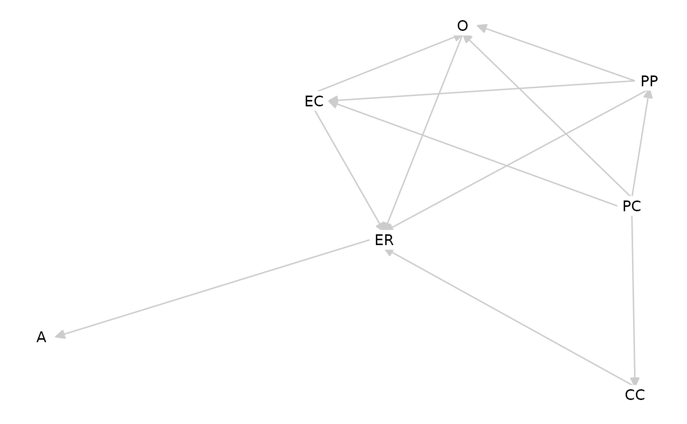

# Using FAIR Theory for Causal Inference

### Introduction

Directed acyclic graphs (DAGs) are a powerful tool for expressing and
testing causal assumptions. They allow researchers to identify potential
confounders or colliders, and guide decisions about which variables to
control for (or not) in statistical analyses (Cinelli, Forney, and Pearl
2022). DAGs can be implemented as FAIR theories, or can be derived from
FAIR theories. In this vignette, we’ll illustrate how to use DAGs for
causal inference in `R`, inspired by the *Tripartite Model* of the
impact of the family on children’s emotion regulation and adjustment
(Morris et al. 2007).

#### Learning Goals

By the end of this tutorial, you will be able to:

Transform a theory represented as a diagram to a FAIR theory

Access and reuse that FAIR theory within a data analysis environment

Generate synthetic data from a FAIR theory

Select control variables using a FAIR theory

Perform basic causal inference based on a FAIR theory

#### Optional: Video Lecture

[This video lecture](https://www.youtube.com/watch?v=wBB4sed9ku0) gives
an introduction to causal inference, with a focus on DAGs comprising
three variables, including the distinction between confounders and
colliders.

### Install and Load Required Packages

We’ll use the following packages:

- `theorytools` for functions pertaining to FAIR theory and a sample
  dataset
- `dagitty` for interacting with Directed Acyclic Graphs (DAGs)
- `tidySEM` for visualizing DAGs

Only run this code if you haven’t already installed these packages:

``` r
install.packages("theorytools")
install.packages("dagitty")
install.packages("tidySEM")
```

``` r
library(theorytools)
library(dagitty)
#> 
#> Attaching package: 'dagitty'
#> The following object is masked from 'package:tidySEM':
#> 
#>     edges
library(tidySEM)
library(ggplot2)
```

### The Tripartite Model

The tripartite model identifies three major familial influences on
children’s emotion regulation (ER):

1.  **Observation (O)**, e.g., modeling parents’ behavior
2.  **Parenting practices (PP)**, e.g., emotion coaching
3.  **Emotional Family Climate (EC)**, e.g., attachment style

These three factors, together with **parent characteristics (PC)** and
**child characteristics (CC)**, shape the child’s **emotion regulation
(ER)**, which in turn influences the child’s **adjustment (A)** (e.g.,
internalizing/externalizing problems, social competence).

The model is visually represented below:


An interpretation of Morris’ Tripartite Model of Emotion Regulation
Development

This figure, loosely based on the visual representation of the theory in
the paper by Morris et al. (2007) (see their Figure 1, p.362). is
relatively well formalized compared to the standard for developmental
psychological theories. Before we can FAIRify this theory, however, we
have to clarify a few things, and make some decisions.

First, notice that the model does not explicitly follow any graphing
convention. It resembles a path diagram, as used to visualize a
structural equation model - but notice that there is an unconnected bold
double-headed arrow near CC (Child Characteristics). The written
description of the text clarifies the meaning of the bold arrow: the
authors argue that Child Characteristics *“moderate relations between
family context \[and\] ER”* (Morris et al., 2007, p. 364).

Second, note that most arrows are bidirectional. This would be fine if
we wished to specify the model as a structural equation model where
associations can be undirected. However, since our goal is to perform
causal inference, we need a **directed** acyclic graph. This means we
have to assume a direction of causality for all bidirectional arrows.
Reading the text helps us direct some arrows: we read that *“children
**learn** about ER through \[Observation\]”*, *“parenting practices
**affect** ER”*, and *“ER **is affected by** the emotional climate”*.
This is all causal language (Norouzi et al. 2025). Even though we later
read that *“ER and familial influences are bidirectional processes in
our model”*, and even though some recent publications have argued that
child effects on parents outweigh parents’ effects on children in
emotional development (Van Lissa and Keizer 2020), for the purpose of
this tutorial, we will assume only parent effects on children. It is
fine to make strong assumptions when specifying theory; if they are
inconsistent with the data, we can revise them later.

Third, note that it is not clear if there is a path from Parenting
Practices to Adjustment. While there are paths from Observation and
Emotional Climate to Adjustment, we read in the text: *“although there
are direct effects of the family context on children’s adjustment \[…\]
a mediational model is proposed”*. Elsewhere in the text, “family
context” is defined in terms of all three predictors (O, PP, and EC). We
can thus either include all three direct effects, or omit them and
assume full mediation. Since the latter option results in a much simpler
DAG, we opt for full mediation.

#### Implementing the Tripartite Model as a DAG

We can implement the model as a DAG using the `dagitty` package. We
start with an “ontology”, or simply, by stating which constructs exist
in our DAG:

    tripartite <- dagitty('dag {
    O
    PP
    EC
    PC
    CC
    ER
    A

Next, we add the directed edges that were present in the original
theory:

    PC -> CC
    PC -> EC
    PC -> PP
    PC -> O

Next, we direct the edges that run from Observation, Parenting
Practices, and Emotional Climate to Emotion Regulation. We omit direct
effects to Adjustment, and include an effect from ER to Adjustment.

    O -> ER
    PP -> ER
    EC -> ER

    ER -> A

Next, we incorporate the effects of Child Characteristics. These are
moderation effects. In a DAG, the interaction effect of two predictors
on an outcome is simply represented by specifying both predictors as
common causes of the outcome. When specifying a model, however, we may
have to explicitly include interaction effects. We can annotate the
graph in such a way that it is clear which variables are involved in
interactions with O, PP, and EC, like this:

    CC -> ER [form="CC:O+CC:PP+CC:EC"];

Note that we use R’s formula syntax, which you may already know from
linear regression models. Here, we specified three interaction terms,
which are specified using the interaction operator `:` and which are
connected by the `+` operator, which means that the interaction effects
form a weighted sum. Finally, we have to make a decision about the
interrelations between the predictors of emotion regulation. We could
omit them, or delve further into the literature to direct them. For now,
I made the following assumptions:

- The Emotional Climate and specific Parenting Practices affect
  children’s Observation (=modeling) of parents’ behavior
- Parenting Practices affect the Emotional Climate

&nbsp;

    PP -> O
    EC -> O
    PP -> EC
    }')

Note that the final line closes our DAG specification, which is stored
in a variable called `tripartite`. Now, we have a complete DAG!

**Quiz**

A DAG can have arrows that run left to right, arrows that run right to
left, and bidirectional arrows. TRUE FALSE

An interaction effect of X1 and X2 on Y is represented in a DAG by
drawing a directed arrow from X1 to Y, and from X2 to Y. TRUE FALSE

Information about functional form, like `[form="CC:O+CC:PP+CC:EC"]`, is
part of the DAG. TRUE FALSE

### From DAG to FAIR Theory

A DAG is not yet a FAIR theory. We can FAIRify the DAG we specified
above by following the steps outlined in the [Making a Theory FAIR
vignette](https://cjvanlissa.github.io/theorytools/articles/fair-theory.html).
We briefly go over the steps here. First, let’s save the DAG to a text
file:

``` r
writeLines(tripartite, "tripartite_model.txt")
```

Your [GitHub integration must be set
up](https://cjvanlissa.github.io/worcs/articles/setup.html) for the next
step to work. You can check if everything is set up correctly by
running:

``` r
worcs::check_git()
worcs::check_github()
```

Next, we can create a FAIR theory repository:

``` r
create_fair_theory(
  path = file.path("c:/theories", "tripartite_model"),
  title = "Tripartite Model",
  theory_file = "tripartite_model.txt",
  remote_repo = "tripartite_model",
  add_license = "cc0")
```

Update the `README.md` file as necessary. Then, go to Zenodo, and
[switch on archiving for this GitHub
repository](https://cjvanlissa.github.io/theorytools/articles/fair-theory.html#select-the-repository-to-archive).
Once this is done, run:

``` r
worcs::git_release_publish(repo = file.path("c:/theories", "tripartite_model"))
```

Finally, you can [edit the
metadata](https://cjvanlissa.github.io/theorytools/articles/fair-theory.html#entering-meta-data)
for the archived version on Zenodo.

The following DOI shows my version of the FAIR Tripartite Model:
<https://doi.org/10.5281/zenodo.14921521>

### Accessing an Existing FAIR Theory

There are several ways in which we can access an existing FAIR theory.
If our goal is simply to use it in our analysis workflow (as is the case
in this tutorial), then we can access the static archived version on
Zenodo by running:

``` r
download_theory(
  id = "https://doi.org/10.5281/zenodo.14921521",
  path = "c:/theories/tripartite_downloaded")
```

If we want to contribute to further theory development, we might instead
prefer to create a local clone of the Git repository. Note that it is
typically a good idea to first [fork the original GitHub
repository](https://github.com/github/docs/blob/main/content/pull-requests/collaborating-with-pull-requests/working-with-forks/fork-a-repo.md)
to your own GitHub account, and then clone your fork, instead of the
original author’s version. Regardless, the function
[`download_theory()`](https://cjvanlissa.github.io/theorytools/reference/download_theory.md)
takes a Git remote address too, in which case it clones the theory:

``` r
download_theory(
  id = "https://github.com/cjvanlissa/tripartite_model.git",
  path = "c:/theories/tripartite_clone")
```

The difference between these two approaches is that the former only
copies the statically archived files to your device, whereas the latter
copies the entire Git repository with its history of commits and all
branches, and continues to version control changes you make.

For this tutorial, please download my version of the Tripartite Model
using `download_zenodo()`.

### X-Interoperability in R

Interoperability pertains to the ability to use a theory in scientific
workflows. X-interoperability refers to the ability to use a theory for
*specific operations* in scientific workflows. When we go through the
remainder of the tutorial, we are demonstrating that our FAIR tripartite
model is X-interoperable for visualization in R, for selecting control
variables, for performing causal inference, et cetera. That is to say:
we can directly ingest the FAIR theory in R, and interact with it in our
analysis environment and use it to construct fully reproducible analysis
workflows, including for causal inference.

First, let’s ingest the theory into our R environment:

``` r
tripartite <- dagitty(paste(readLines("c:/theories/tripartite_downloaded/tripartite_model.txt"), collapse = "\n"))
```

Then, we can plot the model using the `tidySEM` package:

``` r
graph_sem(tripartite)
```



We can optionally specify a layout for the graph, so that it resembles
the model as visualized by Morris and colleagues:

``` r
lo <- get_layout(
  "",   "O",  "",   "", "",
  "",   "PP", "",   "ER",   "A",
  "",   "EC", "",   "",   "",
  "PC", "",   "CC", "",   "",
  rows = 4
)
graph_sem(tripartite, layout = lo)
```


The tidySEM vignette on [plotting structural equation
models](https://cjvanlissa.github.io/tidySEM/articles/Plotting_graphs.html)
further explains how to customize this figure, which is a `ggplot`
object.

**Quiz**

Which of the following describes the property of X-interoperability of a
FAIR theory? It can be reused for a specific operation. It can be reused
for any operation. It can be reused by any person. It is licenced to be
reused.

If you are contributing to theory development, which platform provides
infrastructure to coordinate collaborate with known others and
strangers? GitHub Zenodo RStudio

### Simulating Data from the FAIR Theory

Simulation studies allow us to explore the implications of model
assumptions, to plan our analyses before data collection, to conduct
power analysis and plan our sample size, and to preregister a fully
reproducible analysis pipeline (Preregistration-As-Code, Peikert, Van
Lissa, and Brandmaier 2021; Van Lissa 2022).

Below is a simple code snippet to generate synthetic data using the
[`theorytools::simulate_data()`](https://cjvanlissa.github.io/theorytools/reference/simulate_data.md)
function. This function interprets the DAG as a structural equation
model, samples random values for the path coefficients (unless specific
values are provided), and assumes normal residual variances. Note that
many other functions for simulating data exist, and some may be better
suited to particular use cases.

``` r
set.seed(1)
df_sim <- simulate_data(tripartite, n = 497)
head(df_sim)
#>            A         CC          EC          ER          O         PC
#> 1  1.4283750  0.1952592  0.92442982 -0.02533034 -0.3079385 -0.3320551
#> 2  0.6110565  0.5038031 -0.43340243  0.11994203 -0.1300071 -0.4105931
#> 3  0.9664801 -0.2880780  0.16515985  1.19959014  0.4153041 -0.4792975
#> 4  0.4108811  1.0183695  0.03334491 -1.31108579  0.7340244 -0.9784317
#> 5 -0.5930765 -0.9278015  0.68502195 -0.40608709  0.4953758 -0.2662130
#> 6  2.7303903  0.6736708 -1.96050511  1.30038387 -1.3353841 -1.0096257
#>            PP
#> 1 -0.09642845
#> 2 -0.15211457
#> 3 -0.10912407
#> 4  1.12574549
#> 5 -1.51551309
#> 6 -1.47788571
```

This synthetic dataset is consistent with the structure encoded in our
Tripartite Model, though the parameter values are arbitrary. In real
research, you might use prior studies or expert knowledge to set more
realistic parameter values. For this tutorial, we select some ad-hoc
values, and assign zero (0), small (.2), or medium (.4) effect sizes to
the paths in our DAG:

``` r
tripartite_coef <- dagitty('dag {
O
PP
EC
PC
CC
ER
A

PC -> CC [beta=.4]
PC -> EC [beta=.2]
PC -> PP [beta=.2]
PC -> O [beta=0]

O -> ER [beta=.2]
PP -> ER [beta=0]
EC -> ER [beta=.2]

ER -> A [beta=.4]

CC -> ER [beta=.4];

PP -> O [beta=0]
EC -> O [beta=0]
PP -> EC  [beta=.2]
}')
set.seed(51)
df_sim <- simulateSEM(tripartite_coef, N = 497)
```

### Selecting Control Variables

One advantage of a DAG is the ability to identify **which variables
should be controlled for** (e.g., to avoid confounding) and which
variables should **not** be controlled for (e.g., colliders). In
`dagitty`, you can use the function
[`adjustmentSets()`](https://rdrr.io/pkg/dagitty/man/adjustmentSets.html)
to find minimal sufficient adjustment sets for estimating specific
causal effects.

For instance, let’s say we want to examine the causal effect of
Observation on Emotion Regulation. We can run:

``` r
adjustmentSets(tripartite, exposure="O", outcome="ER")
#> { CC, EC, PP }
#> { EC, PC, PP }
```

The DAG-based algorithm identifies which sets of variables are
sufficient to block backdoor paths, given some strong assumptions (Pearl
1995). The result suggests that it is enough to control for Child
Characteristics, Emotional Climate, and Parenting Practices if we wish
to obtain an unbiased estimate of the effect of Observation on Emotion
Regulation. Alternatively, we can control for Parent Characteristics,
Emotional Climate, and Parenting Practices.

**Quiz**

When estimating the effect of Observation on Emotion Regulation, It is
fine to control for both Child Characteristics and Parent
Characteristics. TRUE FALSE

What is the smallest possible simple adjustment set for the effect of
Child Characteristics on Adjustment? EC, PC, PP EC, O, PP PC

### Basic Causal Inference

Once we know which variables to control for, we can use standard
regression to estimate the causal effect. Using regression assumes that
all causal effects are linear and additive, with normally distributed
residuals and predictors without measurement error. Other methods exist
which do not make these assumptions. We can use the function
[`select_controls()`](https://cjvanlissa.github.io/theorytools/reference/select_controls.md)
to construct a `data.frame` with our exposure, outcome, and the relevant
control variables. This facilitates conducting causal inference with the
appropriate control variables, as you can just use the model formula
`outcome ~ exposure` to obtain the uncontrolled effect, and
`outcome ~ .` to obtain the causal estimate.

``` r
df_controls <- select_controls(tripartite, df_sim, exposure = "O", outcome = "ER")
model_bivariate <- lm(ER ~ O, df_controls)
model_causal <- lm(ER ~., df_controls)
summary(model_bivariate)
#> 
#> Call:
#> lm(formula = ER ~ O, data = df_controls)
#> 
#> Residuals:
#>     Min      1Q  Median      3Q     Max 
#> -2.8773 -0.6705 -0.0366  0.7262  3.2154 
#> 
#> Coefficients:
#>             Estimate Std. Error t value Pr(>|t|)
#> (Intercept) -0.02616    0.04608  -0.568    0.571
#> O            0.06788    0.04652   1.459    0.145
#> 
#> Residual standard error: 1.023 on 495 degrees of freedom
#> Multiple R-squared:  0.004283,   Adjusted R-squared:  0.002271 
#> F-statistic: 2.129 on 1 and 495 DF,  p-value: 0.1452
summary(model_causal)
#> 
#> Call:
#> lm(formula = ER ~ ., data = df_controls)
#> 
#> Residuals:
#>     Min      1Q  Median      3Q     Max 
#> -2.5732 -0.5483  0.0839  0.6073  3.4954 
#> 
#> Coefficients:
#>             Estimate Std. Error t value Pr(>|t|)    
#> (Intercept) -0.03514    0.04053  -0.867  0.38633    
#> O            0.13537    0.04140   3.270  0.00115 ** 
#> CC           0.46224    0.04085  11.315  < 2e-16 ***
#> EC           0.19545    0.03996   4.891 1.36e-06 ***
#> PP          -0.04527    0.04082  -1.109  0.26793    
#> ---
#> Signif. codes:  0 '***' 0.001 '**' 0.01 '*' 0.05 '.' 0.1 ' ' 1
#> 
#> Residual standard error: 0.8965 on 492 degrees of freedom
#> Multiple R-squared:  0.2397, Adjusted R-squared:  0.2335 
#> F-statistic: 38.78 on 4 and 492 DF,  p-value: < 2.2e-16
```

**Quiz**

What is the causal effect of Observation on Emotion Regulation?

There is a significant causal effect of Observation on Emotion
Regulation. TRUE FALSE

If the DAG is correct, then `model_bivariate` gives us an unbiased
estimate of the effect of Observation on Emotion Regulation. TRUE FALSE

### Using Real Data

When working with real data, causal inference quickly becomes more
complicated. Therefore, we provide a “real data” example here, to
practice the relevant skills. The `theorytools` package includes a
dataset that takes inspiration from “Growing Up in Australia - the
Longitudinal Study of Australian Children” (LSAC, Family Studies 2020).
As the LSAC dataset is accessible by explicit permission only, this is a
synthetic dataset with similar properties to the real data. Let’s access
the data:

``` r
head(lsac)
#>     warmth relationship_quality temperament_negreact emotion_regulation
#> 1 3.500000             2.285714                 1.75                2.4
#> 2 5.000000             3.285714                 1.75                1.0
#> 3 5.000000             3.857143                 2.00                2.0
#> 4 3.333333             3.285714                 1.75                1.0
#> 5 4.333333             2.857143                 2.25                1.8
#> 6 2.833333                  NaN                 5.00                1.4
#>   social_functioning coping
#> 1                3.0      2
#> 2                1.6      3
#> 3                1.8      5
#> 4                1.2      3
#> 5                1.2      4
#> 6                2.6      1
```

#### Mapping Theoretical Constructs onto Measured Variables

Using real data, we need to find operationalizations of the theoretical
constructs in our DAG, that is, we need to map the theoretical
constructs onto measured variables. If we inspect the documentation of
the data, we can conclude that the most likely mapping of constructs to
variables is:

``` r
operationalizations <- c(PP = "warmth", EC = "relationship_quality", CC = "temperament_negreact", ER = "emotion_regulation", A = "social_functioning", PC = "coping")
```

Let’s rename the variables, so the data and the DAG are consistent. We
will also perform a rudimentary imputation, as missing data can cause
problems later on. Note that there is abundant literature on best
practices in handling missing data; here, we use single imputation for
pragmatic reasons.

``` r
# Impute missing data
df_real <- VIM::kNN(lsac, numFun = median)
names(df_real) <- names(operationalizations)[match(operationalizations, names(df_real))]
```

Note that one variable is missing: Observation (O). This is unfortunate,
as for the previous example we used O as our exposure variable. For the
remainder of the examples, we will use Parenting Practices as our
exposure variable. Obtain the adjustment set for the effect of Parenting
Practices on Emotion Regulation:

``` r
adjustmentSets(tripartite, exposure = "EC", outcome = "ER")
#> { PC, PP }
```

Any DAG implies conditional independencies: variables that should be
statistically independent from one another, after controlling for a
specific adjustment set. As a kind of assumption check, we could test if
the variables in our dataset indeed show these statistical
independencies. If our data show dependencies where the DAG implies
independence, this can be taken as evidence against the veracity of our
DAG. Of course, there are alternative explanations: how we
operationalized the construct, the presence of measurement error,
sampling bias, et cetera.

The function `localTests` applies the d-separation criterion to
determine all conditional independencies implied by a DAG, and then
performs tests for each of them. Different types of tests are available
for different types of variables. For continuous variables (which we
have), the `"cis.loess"` method provides non-parametric conditional
independence tests using bootstrapped loess regression.

Let’s first conduct conditional independence tests for the dataset that
we simulated from the DAG. Because we’re conducting a lot of
significance tests, we can control the overall probability of making a
Type I error (i.e., drawing false positive conclusions about
discrepancies between DAG and data). We can use Bonferroni-corrected
bootstrapped confidence intervals for testing, as demonstrated in the
following code block:

``` r
# Get all DAG-implied conditional independencies
cis <- impliedConditionalIndependencies(tripartite)
# Bonferroni-corrected confidence interval
bonferroni <- 1-(.05/length(cis))
# Conduct the tests
ci_tests <- localTests(tripartite, df_sim, type = "cis.loess", R = 1000, tests = cis, conf.level = bonferroni)
# Print result, with added significance asterisks
add_significance(ci_tests)
#>                               estimate  std.error       0.25%      99.75%
#> A _||_ CC | ER             -0.02488395 0.04541527 -0.14715226 0.108502878
#> A _||_ EC | ER             -0.08206144 0.04910397 -0.20560400 0.055630567
#> A _||_ O | ER               0.01604344 0.04103371 -0.09277371 0.135921735
#> A _||_ PC | CC, EC, O, PP  -0.06710313 0.04162413 -0.18500210 0.033920284
#> A _||_ PC | ER             -0.06037961 0.04378464 -0.17342936 0.056272447
#> A _||_ PP | ER             -0.01504872 0.04463377 -0.13707558 0.109638952
#> CC _||_ EC | PC            -0.06701484 0.04548868 -0.18696604 0.058277531
#> CC _||_ O | PC             -0.04608873 0.04135799 -0.15492342 0.067892851
#> CC _||_ PP | PC             0.03402876 0.04614528 -0.09232252 0.161732327
#> ER _||_ PC | CC, EC, O, PP -0.11134996 0.04751354 -0.23923411 0.009837374
#>                            significant
#> A _||_ CC | ER                        
#> A _||_ EC | ER                        
#> A _||_ O | ER                         
#> A _||_ PC | CC, EC, O, PP             
#> A _||_ PC | ER                        
#> A _||_ PP | ER                        
#> CC _||_ EC | PC                       
#> CC _||_ O | PC                        
#> CC _||_ PP | PC                       
#> ER _||_ PC | CC, EC, O, PP
```

Now, let’s perform the same tests for the real data. Because we have a
missing variable, we cannot test the complete set. We can filter all
conditional independencies that cannot be tested. Don’t forget to use a
different Bonferroni correction for the resulting (smaller number of)
tests!

``` r
cis_real <- filter_conditional_independencies(cis, df_real)
bonferroni <- 1-(.05/length(cis_real))
# Conduct the tests
ci_tests <- localTests(tripartite, df_real, type = "cis.loess", R = 1000, tests = cis_real, conf.level = bonferroni)
# Print result, with added significance asterisks
add_significance(ci_tests)
#>                    estimate  std.error 0.416666666666665% 99.5833333333333%
#> A _||_ CC | ER   0.33415818 0.01156398          0.3050274        0.36573861
#> A _||_ EC | ER  -0.07461219 0.01175213         -0.1048497       -0.04367367
#> A _||_ PC | ER  -0.18556313 0.01142589         -0.2152855       -0.15789145
#> A _||_ PP | ER  -0.11868779 0.01128070         -0.1465077       -0.09036928
#> CC _||_ EC | PC -0.07078118 0.01182194         -0.1023458       -0.03836728
#> CC _||_ PP | PC -0.19258437 0.01229991         -0.2222188       -0.15670884
#>                 significant
#> A _||_ CC | ER            *
#> A _||_ EC | ER            *
#> A _||_ PC | ER            *
#> A _||_ PP | ER            *
#> CC _||_ EC | PC           *
#> CC _||_ PP | PC           *
```

**Quiz**

We can use Parenting Practices because O is not in its adjustment set.
TRUE FALSE

Which of these causal effects can we estimate using these data? CC -\> A
ER -\> PC PP -\> A All of these

The `ci_tests` give us reasons to doubt that `df_sim` is consistent with
the DAG. TRUE FALSE

The `ci_tests` give us reasons to doubt that `df_real` is consistent
with the DAG. TRUE FALSE

Consider the sample size of `df_real`. Could this be related to your
answers in the previous two questions? No Yes

## References

Cinelli, Carlos, Andrew Forney, and Judea Pearl. 2022. “A Crash Course
in Good and Bad Controls.” *Sociological Methods & Research*, May,
00491241221099552. <https://doi.org/10.1177/00491241221099552>.

Family Studies, Australian Institute of. 2020. “Growing Up in
Australia.” March 23, 2020.

Morris, Amanda Sheffield, Jennifer S. Silk, Laurence Steinberg, Sonya S.
Myers, and Lara Rachel Robinson. 2007. “The Role of the Family Context
in the Development of Emotion Regulation.” *Social Development* 16 (2):
361–88. <https://doi.org/10.1111/j.1467-9507.2007.00389.x>.

Norouzi, Rasoul, Bennett Kleinberg, Jeroen K. Vermunt, and Caspar J. van
Lissa. 2025. “Capturing Causal Claims: A Fine-Tuned Text Mining Model
for Extracting Causal Sentences from Social Science Papers.” *Research
Synthesis Methods* 16 (1): 139–56.
<https://doi.org/10.1017/rsm.2024.13>.

Pearl, Judea. 1995. “Causal Diagrams for Empirical Research.”
*Biometrika* 82 (4): 669–88. <https://doi.org/10.2307/2337329>.

Peikert, Aaron, Caspar J. Van Lissa, and Andreas M. Brandmaier. 2021.
“Reproducible Research in R: A Tutorial on How to Do the Same Thing More
Than Once.” *Psych* 3 (4): 836–67.
<https://doi.org/10.3390/psych3040053>.

Van Lissa, Caspar J. 2022. “Complementing Preregistered Confirmatory
Analyses with Rigorous, Reproducible Exploration Using Machine
Learning.” *Religion, Brain & Behavior* 0 (0): 1–5.
<https://doi.org/10.1080/2153599X.2022.2070254>.

Van Lissa, Caspar J., and Renske Keizer. 2020. “Mothers’ and Fathers’
Quantitative and Qualitative Parenting in Relation to Children’s
Emotional Adjustment: A Between- and Within-Family Investigation.”
*Developmental Psychology* 56 (9): 1709–22.
<https://doi.org/10.1037/dev0001042>.
