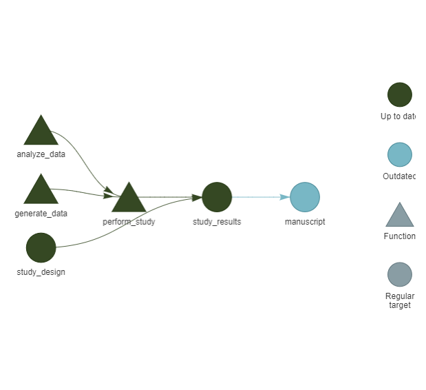

# Conducting Theory-Based Reproducible Simulation Studies

This tutorial introduces a reproducible research workflow for
computational social science studies, based on the [Workflow for Open
Reproducible Code in Science
(WORCS)](https://github.com/cjvanlissa/worcs).

The WORCS workflow, implemented in the `worcs` package, is designed to
create fully reproducible research archives in R. The `theorytools`
R-package is designed to make and work with *FAIR theories*: theories
that are Findable in standardized archives (Zenodo, Open Science
Framework), Accessible using human- and machine-readable file formats,
Interoperable for specific purposes (in this case, conducting
computational simulation studies), and Reusable (licensed to be
iteratively updated, including by others than the original author).

In this tutorial, we combine `worcs` and `theorytools` to conduct a
fully reproducible, theory-driven computational simulation study.

#### Before Starting This Tutorial

You must have [Set up your computer for
WORCS](https://cjvanlissa.github.io/worcs/articles/setup)

Running
[`worcs::check_worcs_installation()`](https://cjvanlissa.github.io/worcs/reference/check_worcs_installation.html)
should return all green checkmarks

#### Learning Goals

In this tutorial, you will learn how to:

Create a reproducible research project using WORCS.

Import a “FAIR theory”, specified as an augmented DAG.

Create a computational simulation study based on the FAIR theory.

Add `targets` to your simulation study to reduce redundant compute

Add integration testing to your study to ensure your functions work as
intended

## Setting up a Reproducible Project with WORCS

### 1. Create a new WORCS Project

WORCS helps automate reproducible workflows by setting up version
control, metadata, licenses, and more.

1.  Open RStudio.
2.  Go to **File \> New Project \> New Directory \> WORCS Project
    Template**.
    1.  Choose a directory name, e.g., `"fair_theory_simulation"`.
    2.  *Optionally*, you can create a GitHub repository. If you have
        GitHub integration set up, all that is required is to specify a
        GitHub remote repository name.
    3.  Keep Manuscript template set to “GitHub document”
    4.  Keep Preregistration template set to “None”
    5.  Keep License set to “cc0” for a CC-0 copyright waiver
    6.  Select “Use renv”
    7.  **De-select** “Use targets”: we will use `targets` in the next
        chapter, but we’ll add support for it manually for didactic
        purposes. Once you’re familiar with the `targets` workflow, feel
        free to add it automatically when creating your next project.
    8.  Select “Open in new session”
3.  Click **Create Project**.

WORCS will now set up a project that implements best practices for
reproducibility. A new Rstudio instance should open automatically.

When working through the next sections, add the code chunks to your
`"manuscript.Rmd"` file except when the code is labeled with
**Interactive:**. Code labeled with **Interactive:** should be run only
once, in the Console window. All other code can be inserted in code
chunks in your `"manuscript.Rmd"` file; knit it regularly to verify that
everything runs as expected.

> What does it mean to run R code *interactively*? Executing code
> immediately in an R session that a human user is interacting with.
> Evaluating code by placing it in an Rmarkdown document, and knitting
> that document. Having one function call another function; these
> functions are said to be ‘interacting’

### 2. Download a FAIR Theory

**Interactive:** You’ll need to install some packages to run this
tutorial. Run this code:

``` r
install.packages("theorytools", prompt = FALSE)
install.packages("dagitty", prompt = FALSE)
install.packages("tidySEM", prompt = FALSE)
```

To your `"manuscript.Rmd"` file, add the following lines in the setup
chunk:

``` r
library(theorytools)
library(dagitty)
library(tidySEM)
```

We will use a FAIR version of **Self-Determination Theory (SDT)**. The
vignette [Formalizing Self-Determination
Theory](https://cjvanlissa.github.io/theorytools/articles/formalizing_sdt.html)
describes how this FAIR theory was created based on the original
Self-Determination Theory (Deci and Ryan 2012). It was specified as a
Directed Acyclic Graph, or DAG: a diagram that specifies the causal
relations proposed by a theory. Such diagrams can be used to derive
hypotheses, select control variables for causal inference, and conduct
simulation studies (as we will do in this tutorial).

**Interactive:** Run the code below to download this existing FAIR
theory, which is stored on Zenodo. It will create a new subfolder called
`"theory/"` for these files, because the theory repository has its own
README and LICENSE files; you don’t want to overwrite those files from
your WORCS repository. Optionally, you can have a look at the archived
version by opening the URL <https://doi.org/10.5281/zenodo.15648655>.

``` r
theorytools::download_theory("10.5281/zenodo.15648655", path = "theory")
```

The theory includes a README file, describing the contents of the other
files, a LICENSE describing how the theory can be reused, a file called
`sdt.txt` containing the DAG, and `definitions.csv`, containing
construct definitions. Note that these definitions require further
specification; as explained [in the Vignette on formalizing
SDT](https://cjvanlissa.github.io/theorytools/articles/formalizing_sdt.html)),
the book chapter describing the theory does not explicitly define any of
the constructs involved.

> Why is the FAIR theory downloaded into a separate `theory/` subfolder?
> Because theorytools only works inside a ‘theory/’ directory To prevent
> overwriting the WORCS project’s README and LICENSE files To avoid
> downloading unnecessary files Because dagitty requires theory files to
> be placed in a specific folder

### 3. Load the FAIR Theory

This FAIR theory is an augmented DAG, which can be read using the
`dagitty` package.

The vignette [Specifying Augmented Directed Acyclic
Graphs](https://cjvanlissa.github.io/theorytools/articles/augmented_dags.html)
describes what augmented DAGs are.

Such DAGs are particularly useful for computational social science
studies, because the `theorytools` package contains methods to convert
augmented DAGs to generative models.

Now, let’s load the augmented DAG. **Note:** when running this code from
a code chunk in your Rmarkdown file, you must use the file path
`../theory/sdt.txt` to go back to the parent directory, because the
manuscript and the theory are both in different subdirectories. If you
run it interactively instead, you are already inside the parent
directory, and you can use the path `theory/sdt.txt`.

``` r
sdt <- dagitty::dagitty(paste(readLines("../theory/sdt.txt"), collapse = "\n"))
```

Then, we can plot the model using the tidySEM package. Get a basic plot
by running `graph_sem(sdt)`:

``` r
tidySEM::graph_sem(sdt)
```


> According to the DAG, what are the causes of `wellbeing`? needs,
> intrinsic\_ \_motivation integration, intrinsic_motivation, needs
> integration, intrinsic_motivation

### 4. Creating a Computational Model

Computational simulation studies allow us to generate and analyze
simulated datasets, for example to:

- Explore what-if scenarios
- Test the implications of model assumptions
- Plan our analyses before data collection
- Conduct power analysis and plan our sample size
- Preregister a fully reproducible analysis pipeline
  (Preregistration-As-Code, Peikert, Van Lissa, and Brandmaier 2021; Van
  Lissa 2022).

Below is a simple code snippet to generate synthetic data using the
[`theorytools::simulate_data()`](https://cjvanlissa.github.io/theorytools/reference/simulate_data.md)
function. This function samples random values for exogenous variables
and computes endogenous variables as functions of their predictors
(linear functions, by default). By default, regression coefficients are
randomly sampled in the range `[-0.6, +0.6]` unless specific values are
provided by the user. You might use prior studies or expert knowledge to
set more realistic parameter values, or use the conventional values for
null (0), small (.2), or medium (.4) effect sizes. By default, normal
distributions are assumed for exogenous variables and residual error,
unless other distributions are specified. Note that many other functions
for simulating data exist, and some may be better suited to particular
use cases. The tutorial on [Specifying Augmented
DAGS](https://cjvanlissa.github.io/theorytools/articles/augmented_dags.html)
contains more information about user-defined functional forms and
(error) distributions.

``` r
set.seed(1)
theorytools::simulate_data(sdt, n = 5)
```

| external_event | healthy_development | integration | intrinsic_motivation | locus_of_causality | needs | wellbeing |
|---------------:|--------------------:|------------:|---------------------:|-------------------:|------:|----------:|
|          -0.33 |               -1.18 |        0.16 |                 0.12 |              -1.04 |  0.78 |     -0.67 |
|          -0.41 |                1.52 |       -0.59 |                -0.99 |              -0.30 | -0.98 |      0.41 |
|          -0.48 |                0.95 |       -0.48 |                -1.77 |               0.51 |  1.07 |      1.77 |
|          -0.98 |               -1.32 |        1.11 |                -1.16 |              -1.83 | -0.02 |      1.58 |
|          -0.27 |               -1.10 |       -0.01 |                -0.64 |               1.28 |  1.17 |      0.54 |

This synthetic dataset is consistent with the structure encoded in our
FAIR SDT, though the parameter values are arbitrary.

> Which of the following is **not a reason** to use computational
> simulation studies? Exploring what-if scenarios Fitting a model to
> real-world data Preregistering a reproducible analysis pipeline
> Conducting power analysis

#### Simplifying the Model

Suppose we are interested in studying the effect of intrinsic motivation
on well-being. Even if our research is grounded in SDT, we do not need
the entire theory to hypothesize about this specific relationship. We
can use the DAG to derive a restricted version of the theory that
includes all variables that might confound the relationship of interest
between intrinsic motivation and well-being:

``` r
sdt_pruned <- theorytools:::prune_dag(sdt,
                                      exposure = "intrinsic_motivation",
                                      outcome = "wellbeing")
sdt_pruned
```

    ## dag {
    ## intrinsic_motivation
    ## needs
    ## wellbeing
    ## intrinsic_motivation -> wellbeing
    ## needs -> intrinsic_motivation
    ## needs -> wellbeing
    ## }

We can now generate a synthetic dataset based on this simplified DAG:

``` r
set.seed(1)
df <- theorytools::simulate_data(sdt_pruned, n = 100)
head(df)
```

| intrinsic_motivation | needs | wellbeing |
|---------------------:|------:|----------:|
|                -0.81 | -0.33 |     -1.19 |
|                -1.22 | -0.41 |     -1.90 |
|                -0.49 | -0.48 |      0.22 |
|                 0.28 | -0.98 |      1.25 |
|                 0.82 | -0.27 |      0.34 |
|                 0.59 | -1.01 |     -1.17 |

### 5. Analyze the Simulated Data

If our goal is to conduct a computational study, we can manipulate any
aspect of the data simulation procedure. These manipulations are the
independent variables of our computational study. We can then apply any
kind of analysis to the simulated data to obtain the outcome (dependent
variable) of our computational study.

One of the most basic types of computational simulation studies is a
power analysis, where we manipulate the true effect size of a parameter
(independent variable: effect size) and calculate whether or not we
observe a significant result for a test of that parameter in the
simulated data (dependent variable: significance).

The analysis function in this case would be a simple significance test
of the parameter of interest. First, we conduct bivariate linear
regression (because the DAG indicated that we need to control for the
effect of needs):

``` r
res <- lm(wellbeing ~ intrinsic_motivation + needs, data = df)
summary(res)
```

    ## 
    ## Call:
    ## lm(formula = wellbeing ~ intrinsic_motivation + needs, data = df)
    ## 
    ## Residuals:
    ##      Min       1Q   Median       3Q      Max 
    ## -2.93688 -0.87862 -0.03086  0.74147  2.56125 
    ## 
    ## Coefficients:
    ##                      Estimate Std. Error t value Pr(>|t|)    
    ## (Intercept)          -0.02492    0.11579  -0.215 0.830069    
    ## intrinsic_motivation  0.44496    0.11522   3.862 0.000203 ***
    ## needs                -0.30228    0.11815  -2.558 0.012061 *  
    ## ---
    ## Signif. codes:  0 '***' 0.001 '**' 0.01 '*' 0.05 '.' 0.1 ' ' 1
    ## 
    ## Residual standard error: 1.126 on 97 degrees of freedom
    ## Multiple R-squared:  0.1839, Adjusted R-squared:  0.1671 
    ## F-statistic: 10.93 on 2 and 97 DF,  p-value: 5.231e-05

Then, our outcome of interest is the significance of the effect of
`intrinsic_motivation`. We can extract the p-value as follows, and
compare it to the significance level $\alpha < .05$ to get a binary
result (significant: TRUE or FALSE):

``` r
sum_res <- summary(res)
sum_res$coefficients["intrinsic_motivation", "Pr(>|t|)"] < .05
```

> Run the code yourself, and answer true or false: In this one dataset,
> the result was significant. TRUE FALSE

## Using `worcs` with `targets`: Sustainable Reproducibility

One of the main tenets of open and reproducible science is the ability
to re-run all analyses from raw data to published output, to ensure that
results are still valid. However, in computationally intensive projects,
re-running unchanged code repeatedly can be redundant, slow, and
wasteful.

The `targets` package reduces unnecessary compute by breaking down an
analysis pipeline into steps that explicitly reference one another,
where each step is only re-computed if either the step changed, or its
inputs changed. Reducing unnecessary computation speeds up the analysis
process and reduces the carbon footprint of analyses (Gupta et al.
2021).

By combining `worcs` with `targets`, we get the best of both worlds:

- `worcs` is used to create a fully reproducible research archive;
- `targets` ensures that redundant steps in a reproducible analysis
  pipeline are not unnecessarily re-computed.

### 6. Add `targets` to the WORCS Project

**Interactive:** Let’s install the packages required for this next
section:

``` r
install.packages("targets", prompt = FALSE)
install.packages("tarchetypes", prompt = FALSE)
```

**Interactive:** Then, add `targets` integration to the `worcs` project
by running:

``` r
worcs::add_targets()
```

Note the status messages. The newly created `_targets.R` file specifies
the steps in the reproducible workflow. The newly created `"./R/"`
directory should contain functions that are used in that workflow.

### 7. Try Running the Pipeline

Open the file `_targets.R`. Note that the default pipeline (which will
look something like the code below) consists of a few placeholder steps:

1.  Create `data`
2.  Run a `model`
3.  Render the `manuscript.Rmd`

``` r
list(
  tar_target(
    name = data,
    command = tibble(x = rnorm(100), y = rnorm(100))
  ),
  tar_target(
    name = model,
    command = coefficients(lm(y ~ x, data = data))
  ),
  tarchetypes::tar_render(manuscript, "manuscript/manuscript.Rmd")
)
```

**Interactive:** You can run this pipeline by executing the command
`targets::tar_make()`.

#### Set a Seed

Computational simulation studies typically rely on random number
generation to repeatedly simulate a scenario with some variability.

This dependency on random numbers makes the results non-reproducible
(the random numbers will be different upon repeated evaluation).

Fortunately, true random numbers are rarely used: we typically use a
sequence of *pseudo* random numbers.

To make the randomness reproducible, we can set a “seed” for the random
number generator. Setting a seed essentially jumps into the sequence of
pseudo-random numbers at the same point each time, so we get the same
“random” numbers over and over.

To set a seed, add the command `set.seed(1)` above the `targets`
pipeline. You can use any number instead of `1`, which will lead to
different results.

#### Debugging

Running `targets::tar_make()` might fail; I have observed two modes of
failure:

1.  It cannot find the file at `../theory/sdt.txt`; changing this to
    `theory/sdt.txt` seems to work. Perhaps `targets::tar_make()`
    evaluates code chunks in the parent directory?
2.  `targets::tar_make()` fails the first time, but succeeds when
    re-running it a second time.

### 8. Create Your Own Functions

Now, let’s create our own functions for the steps we need in our
computational simulation study (power analysis).

#### Function to Generate Data

First, we need a function to generate synthetic data, which allows us to
manipulate the true effect size.

The
[`simulate_data()`](https://cjvanlissa.github.io/theorytools/reference/simulate_data.md)
function we used previously to create a single synthetic dataset can
also generate a script for synthetic data generation:

``` r
theorytools::simulate_data(sdt_pruned, n = 100, run = FALSE)
```

    ##  [1] "# Set random seed"                                                     
    ##  [2] "set.seed(644938424)"                                                   
    ##  [3] "# Set simulation parameters"                                           
    ##  [4] "n <- 100"                                                              
    ##  [5] "# Simulate exogenous nodes"                                            
    ##  [6] "needs <- rnorm(n = n)"                                                 
    ##  [7] "# Simulate endogenous nodes"                                           
    ##  [8] "intrinsic_motivation <- 0.16 * needs + rnorm(n = n)"                   
    ##  [9] "wellbeing <- 0.21 * intrinsic_motivation - 0.21 * needs + rnorm(n = n)"
    ## [10] "df <- data.frame("                                                     
    ## [11] "intrinsic_motivation = intrinsic_motivation,"                          
    ## [12] "needs = needs,"                                                        
    ## [13] "wellbeing = wellbeing"                                                 
    ## [14] ")"

Let’s write this script to a new file in `./R/`, and edit it.

**Interactive:** Run the following code:

``` r
writeLines(
  theorytools::simulate_data(sdt_pruned, n = 100, run = FALSE),
  "R/generate_data.R"
)
```

Open the file `R/generate_data.R`, and edit it as follows (or in any
other way you please):

- Wrap the code in a `fuction()` call with arguments `beta, n`
- Comment out the random seed, so that each run will be different
- Comment out `n <- 100` so that `n` is controlled via the function
  arguments
- Replace the fixed effect size for `intrinsic_motivation` with the
  argument `beta`, so that effect size is controlled via the function
  arguments

&nbsp;

    generate_data <- function(beta, n){
    # Set random seed
    # set.seed(442008606)
    # Set simulation parameters
    # n <- 100
    # Simulate exogenous nodes
    needs <- rnorm(n = n)
    # Simulate endogenous nodes
    intrinsic_motivation <- -(0.19 * needs) + rnorm(n = n)
    wellbeing <- beta * intrinsic_motivation - 0.42 * needs + rnorm(n = n)
    df <- data.frame(
    intrinsic_motivation = intrinsic_motivation,
    needs = needs,
    wellbeing = wellbeing
    )
    return(df)
    }

#### *Optional*: The Effect of Needs

Note that the effect of `needs` on `intrinsic_motivation` and
`wellbeing` is hard-coded in the code snippet above. It is possible to
draw a random value for these effects each time. To do so, you could
(for example) replace the fixed values with
`runif(1, min = -.4, max = .4)`.

#### Function to Analyze Data

Now, create another file called `analyze_data.R` to contain a function
to perform the analysis procedure we defined in step 5:

    analyze_data <- function(df){
    # Conduct linear regression
    res <- lm(wellbeing ~ intrinsic_motivation + needs, data = df)
    # Obtain a model summary
    sum_res <- summary(res)
    # Compare p-value of our coefficient of interest to the significance level, .05
    sum_res$coefficients["intrinsic_motivation", "Pr(>|t|)"] < .05
    }

#### Function to Conduct the Study

We will also need a function to conduct the computational simulation
study itself. Create a file called `perform_study.R`, containing a
function like this (feel free to develop your own):

    perform_study <- function(study_design, reps = 100){
      # For each row of the study design, execute a function
      pwr <- apply(study_design, 1, function(thisrow){
        # Replicate the row of the study design reps times
        out <- replicate(n = reps, expr = {
          # Simulate data with the beta and n from thisrow
          df <- with(as.list(thisrow), generate_data(beta = beta, n = n))
          # Analyze those data
          analyze_data(df)
        })
        # Calculate the proportion of significant results using mean()
        mean(out)
      })
      # Make a data frame containing the study design and study results (pwr)
      data.frame(study_design, power = pwr)
    }

### 9. Create Your Own Pipeline

In the file `_targets.R`, we can now define our own pipeline for our
computational simulation study.

For each step in the pipeline, we define a `tar_target()`, naming the
output with `name`.

Our goal is to create a list that looks something like this:

    list(
      tar_target(
        name = study_design,
        command = ...
      ),
      tar_target(
        name = study_results,
        command = ...
      ),
      tarchetypes::tar_render(manuscript, "manuscript/manuscript.Rmd")
    )

#### Create Study Design

For a power analysis, we can manipulate the true effect size and sample
size.

Let’s say we want to design a study where the true effect size
$\beta \in \lbrack.1,.2,.4\rbrack$ and the sample size
$n \in \lbrack 50,100,200\rbrack$ (for convenience’s sake, we omit an
analysis of false-positive results where $\beta = 0$ now).

We can use the R-function
[`expand.grid()`](https://rdrr.io/r/base/expand.grid.html) to create all
possible combinations:

``` r
expand.grid(
  beta = c(.1, .2, .4),
  n = c(50, 100, 200)
)
```

    ##   beta   n
    ## 1  0.1  50
    ## 2  0.2  50
    ## 3  0.4  50
    ## 4  0.1 100
    ## 5  0.2 100
    ## 6  0.4 100
    ## 7  0.1 200
    ## 8  0.2 200
    ## 9  0.4 200

Add this to the pipeline as follows:

    tar_target(
        name = study_design,
        command = expand.grid(
          beta = c(.1, .2, .4),
          n = c(50, 100, 200)
        )
      )

Now, add another target to conduct the study, based on `study_design`.
Explicitly referencing an object with this `name` will ensure that the
code is re-run if `study_design` changes (verify this yourself).

    tar_target(
        name = study_results,
        command = perform_study(study_design = study_design, reps = 100)
      )

### 10. Edit `manuscript.Rmd`

Now, open `manuscript.Rmd` and edit it to load `study_results` and
tabulate or plot them. To load the study results, replace the default
line `tar_load(model)` (from the mock pipeline created earlier) with
`tar_load(study_results)`. Using `tar_load()` inside of `manuscript.Rmd`
makes the latter dependent on the former. Thus, if `study_results`
changes, the manuscript should be automatically re-run.

**Interactive:** To verify that the interdependencies between pipeline
steps are properly tracked, you can run:

``` r
install.packages("visNetwork", prompt = FALSE)
targets::tar_visnetwork()
```



Add the following code to the manuscript to tabulate the results:

``` r
knitr::kable(study_results, digits = 2)
```

| beta |   n | power |
|-----:|----:|------:|
|  0.0 |  50 |  0.09 |
|  0.2 |  50 |  0.22 |
|  0.4 |  50 |  0.77 |
|  0.0 | 100 |  0.06 |
|  0.2 | 100 |  0.56 |
|  0.4 | 100 |  0.98 |
|  0.0 | 200 |  0.03 |
|  0.2 | 200 |  0.74 |
|  0.4 | 200 |  1.00 |

Or alternatively, add the following code to plot the study results (this
requires running `install.packages("ggplot2", prompt = FALSE)`).

``` r
library(ggplot2)
df_plot <- study_results
df_plot$beta <- ordered(df_plot$beta)
ggplot(df_plot, aes(x = n, y = power, color = beta, shape = beta)) +
  geom_point() +
  geom_line() +
  theme_bw()
```


### 11. Run the Pipeline

**Interactive:** If you were successful, you should be able to run the
pipeline by calling `targets::tar_make()`.

### 12. Add Endpoints

The `worcs` package allows you to specify endpoints for your analysis;
this makes it possible to check whether analysis results are identical
upon repeated evaluation.

If your analysis is/should be fully deterministic, with any random
numbers controlled by [`set.seed()`](https://rdrr.io/r/base/Random.html)
to ensure identical results upon repeated evaluation, then it’s possible
to specify the entire output document (e.g., `manuscript.html`) as an
endpoint.

Alternatively, if your document does depend non-deterministically on
random numbers (e.g., you plot the results with some random jitter),
then it cannot be exactly reproduced. In this case, you can either
remove all non-deterministic sources of randomness, or simply track
deterministic intermediate outputs as endpoints. For example, you could
write the analysis results to a `.csv` file, and track that as an
endpoint.

You can add an endpoint by calling
`worcs::add_endpoint("manuscript/manuscript.html")`. If the endpoint is
intentionally changed (e.g., because you updated your analysis code),
you can update its record by calling
[`worcs::snapshot_endpoints()`](https://cjvanlissa.github.io/worcs/reference/snapshot_endpoints.html).

You can call
[`worcs::reproduce()`](https://cjvanlissa.github.io/worcs/reference/reproduce.html),
which (in a project with `targets`) calls `tar_make()` and then calls
[`worcs::check_endpoints()`](https://cjvanlissa.github.io/worcs/reference/check_endpoints.html)
to verify that the endpoints reproduce after re-running the analysis.

Be very mindful of the fact that `targets` does not re-run pipeline
steps when the step, or the inputs of the step, have not changed. That
means that it might look like your code reproduces upon repeat
evaluation - but only because the code was not actually re-evaluated,
because `targets` retrieved the results from its cache.

To properly evaluate whether your code reproduces, you must first
destroy the cache of pipeline results before running
[`worcs::reproduce()`](https://cjvanlissa.github.io/worcs/reference/reproduce.html).
That causes targets to re-run every step of the pipeline. This might
look like:

``` r
# Snapshot the current state of the endpoints
worcs::snapshot_endpoints()
# Destroy the cache of targets results
targets::tar_destroy()
# worcs::reproduce() calls targets::tar_make(), then worcs::check_endpoints()
worcs::reproduce()
```

## *Optional:* Use Parallel Computation

Computational studies, like power analyses via Monte Carlo simulation,
often require repeating computations many times, which can be
time-consuming. Modern computers (CPUs) usually have multiple “cores”;
by default, a program like Rstudio uses one core - but it’s possible to
assign a task to multiple cores. Parallel computing is the practice of
distributing a computational task across multiple CPU cores,
significantly speeding up execution.

In this section, you’ll learn how to parallelize your simulation study
using the `future` package. This package has a simple interface and can
be implemented in your `perform_study()` function with minimal code
changes.

### 1. Install and Load Required Packages

There are various ways to implement parallel computing, and some methods
are specific to different operating systems. The method below works (at
least) on Windows.

**Interactive:** First, install the required packages:

``` r
install.packages("future", prompt = FALSE)
```

### 2. Adding Paralellization to `perform_study()`

Paralellization in R requires registering a parallel backend:
essentially, starting an R-session on each of the cores you want to use,
and loading the required functions and packages there. These cores do
not have access to the main R-session you are using interactively; they
do not see what variables and functions you have loaded.

To register a parallel backend, you can add the following code to
`perform_study()`:

``` r
library(future)
plan(multisession, workers = 4L)
```

Instead of hard-coding the number of workers (cores) to `4L` (integer
4), you should choose the number based on your computer’s actual number
of cores. You can determine the number of cores by running
[`parallelly::availableCores()`](https://parallelly.futureverse.org/reference/availableCores.html).
While you can use all cores for parallel computing, people often use one
or two fewer so they can keep using their computer while the simulation
is running.

To do so, you could adapt the code as follows:

``` r
library(future)
plan(multisession, workers = parallelly::availableCores()-2L)
```

Note that on Mac or Linux, you might be able to use a more efficient
backend by ‘forking’ processes. To do so, use `plan(multicore)` instead
of `plan(multisession)`.

The package `future.apply` contains parallel equivalents to base R
functions like [`lapply()`](https://rdrr.io/r/base/lapply.html),
[`sapply()`](https://rdrr.io/r/base/lapply.html), and importantly,
[`replicate()`](https://rdrr.io/r/base/lapply.html). To paralellize the
inner loop of our simulation, we can use:

``` r
future.apply::future_replicate(n = reps, expr = {
      df <- with(as.list(thisrow), generate_data(beta = beta, n = n))
      analyze_data(df)
    },
    future.seed = TRUE)
```

The argument `future.seed` ensures that random seeds are properly
handled so the results will be replicable. For more information on seeds
in parallel computation, see [this blog
post](https://www.jottr.org/2020/09/22/push-for-statistical-sound-rng/).

#### What to Paralellize?

Computational simulation studies often consist of loops-within-loops.
Deciding *which loop* to paralellize is a bit of an art form, and an
area of specialization. Considerations that weigh in to the decision
are:

- What is the overhead (in terms of processing time) to set up the
  parallel backend?
- Where is the bottleneck: does the simulation fill up working memory,
  or does it max out your processor? You can [use code
  profiling](https://adv-r.hadley.nz/perf-measure.html) to assess CPU
  and memory bottlenecks, but this is beyond the scope of the present
  tutorial.

In this case, we could paralellize across the 9 conditions of the study,
or across the 100 replications of those conditions. I chose to
paralellize across the 9 study conditions, having each core execute one
condition 100 times. Compare the function `perform_study()` with and
without paralellization:

##### Without Paralellization

``` r
perform_study <- function(study_design, reps = 100){
  # For each row of the study design, execute a function
  pwr <- apply(study_design, 1, function(thisrow){
    # Replicate the row of the study design reps times
    out <- replicate(n = reps, expr = {
      # Simulate data with the beta and n from thisrow
      df <- with(as.list(thisrow), generate_data(beta = beta, n = n))
      # Analyze those data
      analyze_data(df)
    })
    # Calculate the proportion of significant results using mean()
    mean(out)
  })
  # Make a data frame containing the study design and study results (pwr)
  data.frame(study_design, power = pwr)
}
```

##### With Paralellization

``` r
perform_study <- function(study_design, reps = 100){
  library(future)
  # Sets up clusters from number of cores
  plan(multisession, workers = parallelly::availableCores()-2L)
  pwr <- apply(study_design, 1, function(thisrow){
    # Replicate the row of the study design reps times
    out <- future.apply::future_replicate(n = reps, expr = {
      # Simulate data with the beta and n from thisrow
      df <- with(as.list(thisrow), generate_data(beta = beta, n = n))
      # Analyze those data
      analyze_data(df)
    },
    future.seed = TRUE)
    # Calculate the proportion of significant results using mean()
    mean(out)
  })
  data.frame(study_design, power = pwr)
}
```

#### 3. Re-run the Pipeline

Now rerun your simulation with:

``` r
targets::tar_make()
```

Do you notice a speedup? Probably not, because the overhead associated
with setting up the parallel back-end outweighs the time saved by
paralellization. When you are running many repetitions or conducting
large computational simulation studies, there will be time saved. You
can [benchmark your
code](https://www.alexejgossmann.com/benchmarking_r/) to estimate how
much time will be saved (but this is beyond the scope of the present
tutorial).

## *Optional:* Add Integration Tests

Integration testing is a procedure used in software development to
ensure that your code works as expected. In a WORCS project, using
integration tests increases scientific rigor and helps you ensure
reproducibility. This section explains the bare basics of integration
testing for reproducible research workflows; see the [R Packages
book](https://r-pkgs.org/testing-basics.html) for more detail.

#### Why Write Tests?

You probably already test your functions informally - you write a
function, run it in the console, and see if the output looks good. This
is better than nothing - but is it fool-proof? Will you remember which
functions looked good in 6 months? What if someone changes part of your
code? What if functions are used in a different way then you expected?

**Integration tests:**

- Run automatically and consistently.
- Help catch bugs.
- Provide documentation of expected behavior.
- Encourage modular, testable code.

#### When to Test?

- When you write a new function.
- When fixing a bug (add a test to catch it next time).
- Before sharing, submitting, or publishing your analysis.

### 1. Set Up `testthat`

**Interactive**: In your WORCS project, run the following code:

``` r
worcs::add_testthat()
```

This creates a `tests/testthat/` folder to hold your tests. Note the two
suggestions printed in the console:

- Run
  [`usethis::use_test()`](https://usethis.r-lib.org/reference/use_r.html)
  to initialize a basic test file and open it for editing.
- Run
  [`worcs::github_action_testthat()`](https://cjvanlissa.github.io/worcs/reference/github_action_check_endpoints.html)
  to add a GitHub action that evaluates the integration tests.

### 2. Write a Simple Test

Let’s prepare a file to test the behavior of our function
`generate_data()` by running
`usethis::use_test(name = "generate_data")`.

By default, the test file should look like this, testing some common
sense math:

    test_that("multiplication works", {
      expect_equal(2 * 2, 4)
    })

Each test file contains:

- A function call to `test_that()`
- A short description, in this case `"multiplication works"`.
- One or more **expectations** that are evaluated, like `expect_equal()`
  in the example above.

Test files’ names must start with `test-`, and they must be saved in
`tests/testthat/`.

### 3. Run Tests

In your console or script, you can run:

``` r
worcs::test_worcs()
```

Or, to test a single file:

``` r
testthat::test_file("tests/testthat/test-generate_data.R")
```

The output should tell you which tests passed or failed, and why they
failed.

### 4. Customize Your Test

What do we want to test about `generate_data()`?

It’s up to you, but consider testing any assumptions you make about the
function, for example:

- It generates a `data.frame`
- All columns are `numeric`
- The number of rows corresponds to `n`
- The number of columns corresponds to the number of variables in the
  DAG (not tested below)
- At a very high sample size `n`, the regression coefficient of
  `intrinsic_motivation -> wellbeing` approaches `beta` within a certain
  tolerance

What would these assumptions look like when tested? For example, like:

``` r
test_that("generate_data works", {
  # Run generate_data()
  df <- generate_data(.4, 100)
  # It generates a `data.frame`
  expect_s3_class(df, "data.frame")
  # All columns are `numeric`
  expect_true(all(sapply(df, inherits, what = "numeric")))
  # The number of rows corresponds to `n`
  expect_true(nrow(df) == 100)
  # At high n, the regression coefficient approaches beta within tolerance
  set.seed(1)
  df <- generate_data(.4, 100000)
  res <- lm(wellbeing ~ intrinsic_motivation + needs, data = df)
  expect_equivalent(res$coefficients[2], .4, tolerance = .01)
})
```

Copy-paste any of these tests, or write your own. Note that, instead of
grouping all tests, you could also break them up into separate
`test_that()` commands:

``` r
test_that("generate_data generates a data.frame", {
  # Run generate_data()
  df <- generate_data(.4, 100)
  # It generates a `data.frame`
  expect_s3_class(df, "data.frame")
})

test_that("generate_data returns all numeric columns", {
  df <- generate_data(.4, 100)
  expect_true(all(sapply(df, inherits, what = "numeric")))
})
```

The main advantage of this style is that the output of
[`testthat::test_dir()`](https://testthat.r-lib.org/reference/test_dir.html)
will be documented at a more fine-grained level.

### 5. Run your Tests Online

The development platform ‘GitHub’ allows you to run code in the cloud (=
on their servers). This is very useful when checking if your `worcs`
project reproduces on a different system from your own, and also, to run
your integration tests on a different system.

Doing so avoids the famous meme:

    It works on my machine ¯\_(ツ)_/¯

GitHub Actions is an automation tool offered by GitHub, which allows
developers to run workflows directly from their repositories. By using
GitHub Actions, we can automate processes such as continuous
integration, continuous deployment, testing, and code reviews.

GitHub Actions are triggered by events - for example, when pushing code
updates to GitHub.

**Interactive:** Let’s set up a GitHub action to run our integration
tests:

``` r
# Add the appropriate GitHub action:
worcs::github_action_testthat()
```

**Interactive:** The virtual computer environment on GitHub actions will
attempt to recreate your local environment based on the `renv`
dependency manager. To ensure that your `renv` records are up to date,
run the code below. It is important to always snapshot your dependencies
before reproducing your analyses on another system; so run
[`renv::snapshot()`](https://rstudio.github.io/renv/reference/snapshot.html)
before publishing your code, before triggering a GitHub action, before
sharing your code with a collaborator, et cetera.

``` r
renv::snapshot()
```

**Interactive:** Now, push your code to GitHub. Among the files that
will be updated are instructions for GitHub actions in the `.github/`
folder, and your updated `renv.lock` file.

``` r
worcs::git_update("add testthat")
```

Since this GitHub action is triggered by pushing code to GitHub, if you
now navigate to your GitHub repository. If you don’t remember your
GitHub URL, run:

``` r
utils::browseURL(gsub(".git", "/actions", gert::git_remote_list()$url, fixed = TRUE))
```

You should see the action running. If all is good, it will show you a
green dot (red if there are errors).

Integration testing gives you peace of mind - you know that your code
works as expected, and via GitHub actions, can show it to the world too.

### 6. Reproducing your Analysis Online

The `worcs` package also includes functionality to reproduce your entire
analysis online via GitHub actions. However, running a full simulation
study is probably not fair use of GitHub’s servers, and might raise some
eyebrows.

For other, smaller scale studies, [the vignette on
endpoints](https://cjvanlissa.github.io/worcs/articles/endpoints.html)
explains how to create a GitHub action to reproduce your analyses in the
cloud.

## Additional Resources

- [Using targets to Reduce Redundant
  Computations](https://cjvanlissa.github.io/worcs/articles/targets.html)
- [WORCS documentation](https://cjvanlissa.github.io/worcs/)
- [theorytools documentation](https://cjvanlissa.github.io/theorytools/)
- [FAIR Principles](https://www.go-fair.org/fair-principles/)
- [TOP Guidelines](https://www.cos.io/initiatives/top-guidelines)
- [Paralellizing your
  Code](https://computing.stat.berkeley.edu/tutorial-dask-future/R-future.html)

## References

Deci, Edward L., and Richard M. Ryan. 2012. “Self-Determination Theory.”
In *Handbook of Theories of Social Psychology: Volume 1*, edited by Paul
A. M. Van Lange, Arie W.Kruglanski, and E. ToryHiggins, 416–37. SAGE
Publications Ltd. <https://doi.org/10.4135/9781446249215>.

Gupta, Udit, Young Geun Kim, Sylvia Lee, Jordan Tse, Hsien-Hsin S. Lee,
Gu-Yeon Wei, David Brooks, and Carole-Jean Wu. 2021. “Chasing Carbon:
The Elusive Environmental Footprint of Computing.” In *2021 IEEE
International Symposium on High-Performance Computer Architecture
(HPCA)*, 854–67. <https://doi.org/10.1109/HPCA51647.2021.00076>.

Peikert, Aaron, Caspar J. Van Lissa, and Andreas M. Brandmaier. 2021.
“Reproducible Research in R: A Tutorial on How to Do the Same Thing More
Than Once.” *Psych* 3 (4): 836–67.
<https://doi.org/10.3390/psych3040053>.

Van Lissa, Caspar J. 2022. “Complementing Preregistered Confirmatory
Analyses with Rigorous, Reproducible Exploration Using Machine
Learning.” *Religion, Brain & Behavior* 0 (0): 1–5.
<https://doi.org/10.1080/2153599X.2022.2070254>.
