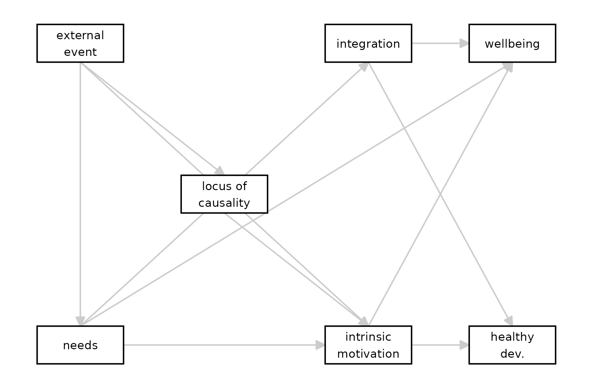

# Formalizing Self-Determination Theory

This vignette is based on work conducted as part of the “Proposition
Based Theory Specification” (PBTS) project by Andreas Glöckner, Susann
Fiedler, Jennifer Biehl, & Jasper Siol (in preparation). In this
“many-theorists project”, groups of scholars were each assigned a
chapter of the “Handbook of Theories of Social Psychology” (Van Lange,
Kruglanski, and Higgins 2012), and asked to specify it and document the
process.

Van Lissa, Li, and Weber set out to formalize Deci and Ryan’s
*Self-Determination Theory*, documented in Chapter 20 of the book (Deci
and Ryan 2012). The definition of SDT used for the theory specification
exercise was taken from this book chapter, but seems to be fully
consistent with the description on
<https://selfdeterminationtheory.org/the-theory/>.

#### Time to Complete

Estimated time to complete: 45-60 minutes.

#### Learning Goals

Translate a theory described in prose to a series of IF-THEN
propositions

Document construct definitions and operationalizations of a theory

Translate IF-THEN propositions to a Directed Acyclic Graph

Publish the resulting theory as a FAIR Theory on Zenodo

## Step 1: Select Relevant Sources

In the first step of the PBTS procedure, we were asked to select sources
for the theory specification and agree on these sources with fellow
raters; to detect relevant text snippets within these sources that
contain descriptions of the definitions, causal relations, et cetera as
proposed by the theory; and to agree with the fellow coders on these
snippets. We decided to use only the book chapter as a source. As an
example, the first snippet we selected was:

> “For these natural, active processes of intrinsic motivation and
> integration to operate effectively toward healthy development and
> psychological well-being, human beings need particular nutriments –
> both biological and psychological (Ryan, 1995). In the relative
> absence of such nutriments, these natural processes will be impaired,
> resulting in experiences, development, and behaviors that are less
> than optimal. (Deci & Ryan, 2012, p. 417)

Expand the section below to see all selected snippets:

See all snippets

> **Snippet 1:** “For these natural, active processes of intrinsic
> motivation and integration to operate effectively toward healthy
> development and psychological well-being, human beings need particular
> nutriments – both biological and psychological (Ryan, 1995). In the
> relative absence of such nutriments, these natural processes will be
> impaired, resulting in experiences, development, and behaviors that
> are less than optimal. (Deci & Ryan, 2012, p. 417)

> **Snippet 2:** “The three basic psychological needs are universal such
> that their satisfaction versus thwarting affects the psychological
> well-being of all people.” (Deci & Ryan, 2012, p. 425)

> **Snippet 3:** “rewards do not always motivate subsequent persistence;
> indeed they can undermine intrinsic motivation” (Deci & Ryan, 2012,
> p. 417)

> **Snippet 4:** “\[Intrinsic motivation\] could be either undermined or
> enhanced depending on whether the social environment supported or
> thwarted the needs for competence and self-determination. If a reward
> or other external event such as threat of punishment (Deci and Cascio,
> 1972), positive feedback (Deci, 1971), competition (Deci and Betley et
> al., 1981), or choice (Zuckerman et al., 1978) were expected to thwart
> these basic needs, it was predicted to prompt an external perceived
> locus of causality and undermine intrinsic motivation; but if the
> event were expected to support these basic needs, it was predicted to
> prompt an internal perceived locus of causality and enhance intrinsic
> motivation.” (Deci & Ryan, 2012, p. 418)

## Step 2: Extract IF-THEN Propositions

Each individual coder then set out to extract a set of IF-THEN
propositions from the selected snippets that, together, describe the
theory.

Let’s examine the first snippet, and code it for implied causality. The
causes are coded in green, and outcomes in blue:

> “For these natural, active **processes of intrinsic motivation and
> integration** to operate effectively toward **healthy development and
> psychological well-being**, human beings need particular
> **nutriments** – both biological and psychological (Ryan, 1995). In
> the relative absence of such **nutriments**, these natural
> **processes** will be impaired, resulting in **experiences,
> development, and behaviors** that are less than optimal” (Lange et
> al., 2012, p. 417)

The text is a bit ambiguous, and possibly redundant. We see that
**processes**, in the first sentence, refers to intrinsic motivation and
integration. This invites the question of the relationship between
intrinsic motivation and integration - do they go hand in hand (i.e.,
just two examples of processes set in motion by nutriments)? Are they
distinct but similarly related to other constructs? It’s not clear.
Furthermore, in the second sentence, we find the word **processes**
again, but this time without explicit reference to intrinsic motivation
and integration. For now, we will assume that intrinsic motivation and
integration are distinct but have similar relationships to other
constructs, and that the word is used consistently across both
sentences.

**Nutriments** is defined elsewhere in the text - it appears to refer to
refer to the three basic needs, as well as biological necessities.

**Experiences, development, and behaviors** is not well-defined, but we
might assume it refers back to **healthy development and psychological
well-being**.

We could reconstruct implied propositions as follows:

1.  Processes (intrinsic motivation AND integration) -\> healthy
    development AND psychological well-being (*processes of intrinsic
    motivation and integration \[operate effectively toward\] healthy
    development and psychological well-being*)
2.  Nutriments -\> Processes (*human beings \[need\] nutriments \[…\]
    for these processes to operate etc.*)
3.  Nutriments -\> Processes (*In the \[absence of\] nutriments \[…\]
    processes will be impaired*)
4.  Processes -\> Healthy development AND psychological well-being
    (*processes will be impaired, resulting in experiences, development,
    and behaviors*)

Assuming that our interpretations are correct, we see that the snippet
redundantly states the same two relationships twice; once phrased in the
positive and once in the negative.

Let’s apply the same coding procedure to all snippets:

|   N | IF                                                    | THEN                                                        | Original                                                                                                                                                                                                                                                                                                                                                                                                                                                                                                                                                                                                                                                                                                                                        |
|----:|:------------------------------------------------------|:------------------------------------------------------------|:------------------------------------------------------------------------------------------------------------------------------------------------------------------------------------------------------------------------------------------------------------------------------------------------------------------------------------------------------------------------------------------------------------------------------------------------------------------------------------------------------------------------------------------------------------------------------------------------------------------------------------------------------------------------------------------------------------------------------------------------|
|   1 | nutriments are absent                                 | intrinsic motivation AND integration are impaired           | “For these natural, active processes of intrinsic motivation and integration to operate effectively toward healthy development and psychological well-being, human beings need particular nutriments – both biological and psychological (Ryan, 1995). In the relative absence of such nutriments, these natural processes will be impaired, resulting in experiences, development, and behaviors that are less than optimal. (Deci & Ryan, 2012, p. 417)                                                                                                                                                                                                                                                                                       |
|   2 | \[intrinsic motivation OR integration\] is present    | healthy development AND psychological well-being take place | “For these natural, active processes of intrinsic motivation and integration to operate effectively toward healthy development and psychological well-being, human beings need particular nutriments – both biological and psychological (Ryan, 1995). In the relative absence of such nutriments, these natural processes will be impaired, resulting in experiences, development, and behaviors that are less than optimal. (Deci & Ryan, 2012, p. 417)                                                                                                                                                                                                                                                                                       |
|   3 | needs are satisfied or thwarted                       | psychological well-being of all people is affected          | “The three basic psychological needs are universal such that their satisfaction versus thwarting affects the psychological well-being of all people.” (Deci & Ryan, 2012, p. 425)                                                                                                                                                                                                                                                                                                                                                                                                                                                                                                                                                               |
|   4 | rewards given                                         | intrinsic motivation can decrease                           | “rewards do not always motivate subsequent persistence; indeed they can undermine intrinsic motivation” (Deci & Ryan, 2012, p. 417)                                                                                                                                                                                                                                                                                                                                                                                                                                                                                                                                                                                                             |
|   5 | external event is expected to thwart the basic needs  | external perceived locus of causality                       | “\[Intrinsic motivation\] could be either undermined or enhanced depending on whether the social environment supported or thwarted the needs for competence and self-determination. If a reward or other external event such as threat of punishment (Deci and Cascio, 1972), positive feedback (Deci, 1971), competition (Deci and Betley et al., 1981), or choice (Zuckerman et al., 1978) were expected to thwart these basic needs, it was predicted to prompt an external perceived locus of causality and undermine intrinsic motivation; but if the event were expected to support these basic needs, it was predicted to prompt an internal perceived locus of causality and enhance intrinsic motivation.” (Deci & Ryan, 2012, p. 418) |
|   6 | external perceived locus of causality                 | undermined intrinsic motivation                             | “\[Intrinsic motivation\] could be either undermined or enhanced depending on whether the social environment supported or thwarted the needs for competence and self-determination. If a reward or other external event such as threat of punishment (Deci and Cascio, 1972), positive feedback (Deci, 1971), competition (Deci and Betley et al., 1981), or choice (Zuckerman et al., 1978) were expected to thwart these basic needs, it was predicted to prompt an external perceived locus of causality and undermine intrinsic motivation; but if the event were expected to support these basic needs, it was predicted to prompt an internal perceived locus of causality and enhance intrinsic motivation.” (Deci & Ryan, 2012, p. 418) |
|   7 | external event is expected to support the basic needs | internal perceived locus of causality                       | “\[Intrinsic motivation\] could be either undermined or enhanced depending on whether the social environment supported or thwarted the needs for competence and self-determination. If a reward or other external event such as threat of punishment (Deci and Cascio, 1972), positive feedback (Deci, 1971), competition (Deci and Betley et al., 1981), or choice (Zuckerman et al., 1978) were expected to thwart these basic needs, it was predicted to prompt an external perceived locus of causality and undermine intrinsic motivation; but if the event were expected to support these basic needs, it was predicted to prompt an internal perceived locus of causality and enhance intrinsic motivation.” (Deci & Ryan, 2012, p. 418) |
|   8 | internal perceived locus of causality                 | enhanced intrinsic motivation                               | “\[Intrinsic motivation\] could be either undermined or enhanced depending on whether the social environment supported or thwarted the needs for competence and self-determination. If a reward or other external event such as threat of punishment (Deci and Cascio, 1972), positive feedback (Deci, 1971), competition (Deci and Betley et al., 1981), or choice (Zuckerman et al., 1978) were expected to thwart these basic needs, it was predicted to prompt an external perceived locus of causality and undermine intrinsic motivation; but if the event were expected to support these basic needs, it was predicted to prompt an internal perceived locus of causality and enhance intrinsic motivation.” (Deci & Ryan, 2012, p. 418) |

SDT translated into IF/THEN statements

### From IF-THEN Propositions to Causal Model

The IF-THEN specification prescribed by the PBTS framework has some
limitations here; for example, it is not so well-suited to describe a
difference in degrees (people are affected a little bit), or a
probabilistic effect (some people are affected, but not all). Except
proposition \#3, which explicitly states that people are universally
affected, none of the original statements appear to be binary. However,
the direction of causality is relatively clear. Thus, a better fit might
be a Directed Acyclic Graph (DAG), which incurs the additional advantage
of being X-interoperable with covariate selection and data generation
(see [this
vignette](https://cjvanlissa.github.io/theorytools/articles/causal-inference.html)).

We can translate these IF-THEN statements into causal links between
specific constructs. The result is contained in a file included in the
`theorytools` package, which we load below. Note that the numbers
associated with the statements are retained, so that it is clear which
causal links are derived from which IF/THEN statements:

``` r
SDT <- read.csv(system.file("sdt.txt", package="theorytools"))
knitr::kable(SDT[, 1:3], caption = "IF/THEN statements translated into causal connections")
```

|  Nr | from                 | to                   |
|----:|:---------------------|:---------------------|
|   1 | needs                | intrinsic_motivation |
|   1 | needs                | integration          |
|   2 | intrinsic_motivation | healthy_development  |
|   2 | intrinsic_motivation | wellbeing            |
|   2 | integration          | healthy_development  |
|   2 | integration          | wellbeing            |
|   3 | needs                | wellbeing            |
|   4 | external_event       | intrinsic_motivation |
|   5 | external_event       | needs                |
|   5 | external_event       | locus_of_causality   |
|   6 | locus_of_causality   | intrinsic_motivation |
|   7 | external_event       | locus_of_causality   |
|   7 | external_event       | needs                |
|   8 | locus_of_causality   | intrinsic_motivation |

IF/THEN statements translated into causal connections

This translation reveals some further ambiguities; for example, in
proposition \#4, we see “rewards” are related to intrinsic motivation.
However, in the remainder of the text, rewards are mentioned as just one
example of “external events”. We assumed that “rewards” is used as an
example of the broader class of external events.

Another ambiguity: we read that “If \[an external event\] were expected
to thwart \[basic needs\], it \[prompts\] an external perceived locus of
causality”. Since the theory otherwise does not explain how people might
“expect” that external events will affect them, and this seems to be
more of a question for cognitive than social psychology - we made a
simplifying assumption: external events affect needs, and also perceived
locus of causality.

This specification also reveals redundancies in the original theory.
Many propositions are repeated, once phrased in a positive way, and once
phrased in a negative way. This can be confusing, especially if the two
phrasings differ slightly; for example, in snippet \#1, the positive
phrasing refers to “healthy development and psychological well-being” as
ultimate outcome of need satisfaction, and the negative phrasing refers
to “experiences, development, and behaviors” as ultimate outcomes of
need frustration. While it seems safe to assume that both sentences have
the same meaning, there is ambiguity here. When the statements are
reduced to their implied causal connections, the redundancies become
readily apparent. We can simply remove the redundancies as follows:

``` r
# Drop statement numbers
SDT <- SDT[, 2:3]
# Remove redundant statements
SDT <- SDT[!duplicated(SDT), ]
knitr::kable(SDT, caption = "Unique causal connections")
```

| from                 | to                   |
|:---------------------|:---------------------|
| needs                | intrinsic_motivation |
| needs                | integration          |
| intrinsic_motivation | healthy_development  |
| intrinsic_motivation | wellbeing            |
| integration          | healthy_development  |
| integration          | wellbeing            |
| needs                | wellbeing            |
| external_event       | intrinsic_motivation |
| external_event       | needs                |
| external_event       | locus_of_causality   |
| locus_of_causality   | intrinsic_motivation |

Unique causal connections

We can translate this table to a DAG:

``` r
SDT <- dagitty::dagitty(
  paste0("dag {",
  paste0(SDT$from, " -> ", SDT$to, collapse = "\n"),
  "}")
)
```

We can plot the DAG as follows:

``` r
library(tidySEM)
library(ggplot2)
# Specify plot layout
lo <- get_layout(
"EE", "",   "IN", "WB",
"",   "LC", "",   "",
"NE", "",   "IM", "HD",
  rows = 3
)
# Rename nodes
renam <- c(EE = "external_event", NE = "needs", IN = "integration", WB = "wellbeing", 
           LC = "locus_of_causality", HD = "healthy_development", IM = "intrinsic_motivation")
lo[match(names(renam), lo)] <- renam
# Prepare the graph
p <- prepare_graph(SDT, layout = lo, angle = 179, text_size = 3, rect_width = 1.5, spacing_x = 2.5)

# Change node shape
p$nodes$shape <- "rect"
# Change node labels
renam <- c(external_event = "external\nevent", needs = "needs", integration = "integration", wellbeing = "wellbeing", 
           locus_of_causality = "locus of\ncausality", healthy_development = "healthy\ndev.", intrinsic_motivation = "intrinsic\nmotivation")
p$nodes$label <- renam[p$nodes$name]
# Plot the graph
plot(p)
```



Causal diagram implied by SDT

## Step 3. Define and Operationalize Concepts

In this step, we were asked to add definitions for each concept referred
to by the author of the theory. In principle, we were asked to refer to
text snippets from the sources determined in Step 1. However, in case
definitions were not provided by the author (which was the case for all
constructs in this theory), we were allowed to derive them from the
scientific literature. When operationalizations could not be derived
from any relevant sources, they were coded as missing. The resulting
definitions are stored inside the `theorytools` package and we can load
them as follows:

``` r
definitions <- read.csv(system.file("sdt_definitions.csv",package="theorytools"))
definitions
```

|     | Nr. | Concept                               | Synonym                                                              | Definition                            | Operationalization                                                                                                                                                                                                                                                                                                                                                                      |
|:----|----:|:--------------------------------------|:---------------------------------------------------------------------|:--------------------------------------|:----------------------------------------------------------------------------------------------------------------------------------------------------------------------------------------------------------------------------------------------------------------------------------------------------------------------------------------------------------------------------------------|
| 2   |   2 | Intrinsic motivation                  | processes                                                            | Intrinsic motivation                  | Derived from other source: Not given in chapter, but chapter references paper with definition: Mean number of seconds spent working on puzzle during eight-minute free choice period. Reference: <https://doi.org/10.1037/h0030644>                                                                                                                                                     |
| 3   |   3 | integration                           | processes                                                            | integration                           | Derived from other source: Not given in chapter, But chapter references paper with definition: “ongoing reciprocal assimilation between schemas, such that there tends to be an internal consistency and equilibration among varied functions and structures”. Reference: <https://doi.org/10.1111/j.1467-6494.1995.tb00501.x>                                                          |
| 4   |   4 | Healthy development                   |                                                                      | Healthy development                   | Missing: Not given in chapter, could not find                                                                                                                                                                                                                                                                                                                                           |
| 5   |   5 | Psychological wellbeing               |                                                                      | Psychological wellbeing               | Derived from other source: Not given in chapter, chapter cites paper with definition: “positive affect, vitality, and physical symptoms”. Reference: <https://doi.org/10.1177/01461672962212007>                                                                                                                                                                                        |
| 6   |   6 | external event                        | reward, threat of punishment, positive feedback, competition, choice | Various external events               | Positive feedback (Ryan, 1982), performance-contingent monetary rewards (Ryan et al., 1983), limits set on children (Koestner et al., 1984). References: Ryan, 1982 <https://doi.org/10.1037/0022-3514.43.3.450> Ryan et al., 1983 <https://doi.org/10.1037/0022-3514.45.4.736> Koestner et al., 1984 <https://selfdeterminationtheory.org/SDT/documents/1984_KoestnerRyanBernHolt.pdf> |
| 7   |   7 | external perceived locus of causality |                                                                      | external perceived locus of causality | Derived from other source: Not given in chapter. Most useful resource is Ryan & Connell, 1989 <https://doi.org/10.1037/0022-3514.57.5.749> They use structured interviews, and the Multidimensional Measure of Children’s Perceptions of Control (Connell, 1985). Reference: Ryan & Connell, 1989 <https://doi.org/10.1037/0022-3514.57.5.749>                                          |
| 8   |   8 | internal perceived locus of causality |                                                                      | internal perceived locus of causality | Derived from other source: Not given in chapter. Most useful resource is Ryan & Connell, 1989 <https://doi.org/10.1037/0022-3514.57.5.749> They use structured interviews, and the Multidimensional Measure of Children’s Perceptions of Control (Connell, 1985). Reference: Ryan & Connell, 1989 <https://doi.org/10.1037/0022-3514.57.5.749>                                          |

Operationalizations of constructs in SDT

As can be seen fom this overview - none of the definitions were given in
the theory chapter. We were able to trace some definitions to empirical
papers cited in the chapter, but these definitions appeared to fall
short of proper “theoretical definitions”. For example, **intrinsic
motivation** was defined as “number of seconds spent working on a
puzzle”. This is a purely behaviorist definition of an internal state.

In other words: While the theory is relatively explicit about causal
links between constructs (with just a few ambiguities), it appears that
important work remains to be done in terms of defining the constructs
involved in the theory. While it is possible and likely that domain
experts would be able to easily resolve some of these ambiguities and
definitions, this is the best we could do. We will now create a FAIR
theory archive, and invite others to further develop this theory.

## Archiving SDT as FAIR Theory

We will automate most steps of FAIR theory creation; to go through the
process manually, see [this
vignette](https://cjvanlissa.github.io/theorytools/articles/fair-theory.html)).
Let’s create two files for our theory: a DAG to specify the causal
relations, and a spreadsheet containing the definitions.

``` r
writeLines(SDT, "sdt.txt")
write.csv(definitions, "definitions.csv", row.names = FALSE)
```

Next, we can create the FAIR theory as follows:

``` r
project_path <- file.path("c:/theories", "self_determination_theory")
create_fair_theory(
  path = project_path,
  title = "Self-Determination Theory",
  theory_file = c("sdt.txt", "definitions.csv"),
  remote_repo = "self_determination_theory",
  add_license = "cc0")
```

We will manually complete the following steps:

Update README file

Connect GitHub to Zenodo

Push local updates to GitHub

Publish a release on GitHub, which triggers a release on Zenodo

### Documenting Interoperability with a README File

We customized the README by adding these sections:

> **Description** This is a FAIR theory (Van Lissa et al., 2025)
> specification of Deci and Ryan’s *Self-Determination Theory* (Deci &
> Ryan, 2012). The definition of SDT used for the theory specification
> exercise was taken from this book chapter, but seems to be fully
> consistent with the description on
> <https://selfdeterminationtheory.org/the-theory/>.  
> The theory was first specified by Van Lissa, Li, and Weber as part of
> the “Proposition Based Theory Specification” (PBTS) project by Andreas
> Glöckner, Susann Fiedler, Jennifer Biehl, & Jasper Siol (in
> preparation). In this “many-theorists project”, groups of scholars
> were each assigned a chapter of the “Handbook of Theories of Social
> Psychology” (Van Lange, Kruglanski, and Higgins 2012), and asked to
> specify it and document the process.  
> Van Lissa further adapted the theory specification, as documented in
> [this
> vignette](https://cjvanlissa.github.io/theorytools/articles/formalizing_sdt.html).

> **Interoperability**  
> `sdt.txt` This file contains the main theory, specified as a DAG. It
> is interoperable for causal inference and data simulation in R, as
> explained in [this
> vignette](https://cjvanlissa.github.io/theorytools/articles/causal-inference.html).  
> `definitions.csv` This file contains the definitions of the constructs
> in `sdt.txt` we were able to find. At present, this file is not very
> interoperable. We urgently invite domain experts to propose more
> concrete definitions of the constructs (as our attempt to identify the
> intended definitions likely fell short), or to propose new and better
> definitions.

> **Related works**

> Deci, E. L., & Ryan, R. M. (2012). Self-Determination Theory. In P. A.
> M. V. Lange, A. W.Kruglanski, & E. ToryHiggins (Eds.), Handbook of
> Theories of Social Psychology: Volume 1 (pp. 416–437). SAGE
> Publications Ltd. <https://doi.org/10.4135/9781446249215>

### Authorize ‘GitHub’ to connect with ‘Zenodo’

On the ‘Zenodo’ website navigate to the [‘GitHub’ repository listing
page](https://zenodo.org/account/settings/github/) and simply “flip the
switch” next to your repository. If your repository **does not show up**
in the list, you may need to press the ‘Synchronize now’ button. At the
time of writing, we noticed that it can take quite a while (hours?) for
‘Zenodo’ to detect new ‘GitHub’ repositories. If so, take a break or
come back to this last step tomorrow!


Enable individual ‘GitHub’ repositories to be archived in ‘Zenodo’

Flip the switch to set up a new webhook between ‘Zenodo’ and your
repository.

### Create a New Release

To archive a repository on ‘Zenodo’, you must create a new release.
Since we changed the README file, first, add, commit, and push these
changes to the remote repository using `git_update()`. Then, publish the
release using `git_release_publish()`:

``` r
worcs::git_update(repo = project_path)
worcs::git_release_publish(repo = project_path)
```

### Updating Zenodo Meta-Data

We can further document our ‘Zenodo’ archive as a FAIR theory by adding
some extra information on ‘Zenodo’. Note that, if you created a
`.zenodo.json` file in a previous step, some of these metadata will be
populated automatically. On ‘Zenodo’ click the
[Upload](https://zenodo.org/deposit) tab in the main menu, where you
should find your newly uploaded repository.


Click the orange Edit button.

Click the orange `Edit` button, and verify/supply the following
information:

**Keywords**: Following a paper by Deci & Ryan (2008), we added the
keywords `self-determination theory`, `autonomous motivation`, and
`personality development`. **Related works**: We added the DOI of the
book chapter by Deci & Ryan (2012), with the relation `Is derived from`,
as well as the DOIs of the papers referenced in `definitions.csv`, with
relation type `References`. While citing these DOIs inside the file
renders them Accessible and Interoperable for sentient readers,
additionally documenting them in the DataCite metadata makes them
Accessible and Interoperable for library systems and other scholarly
analytics software.

To save these changes, click ‘Publish’.

View the final result, FAIR Self-Determination Theory, at
<https://doi.org/10.5281/zenodo.15648655>.

Deci, Edward L., and Richard M. Ryan. 2012. “Self-Determination Theory.”
In *Handbook of Theories of Social Psychology: Volume 1*, edited by Paul
A. M. Van Lange, Arie W.Kruglanski, and E. ToryHiggins, 416–37. SAGE
Publications Ltd. <https://doi.org/10.4135/9781446249215>.

Van Lange, Paul, Arie Kruglanski, and E. Higgins. 2012. *Handbook of
Theories of Social Psychology: Volume 1*. 1 Oliver’s Yard, 55 City
Road, London EC1Y 1SP United Kingdom: SAGE Publications Ltd.
<https://doi.org/10.4135/9781446249215>.
