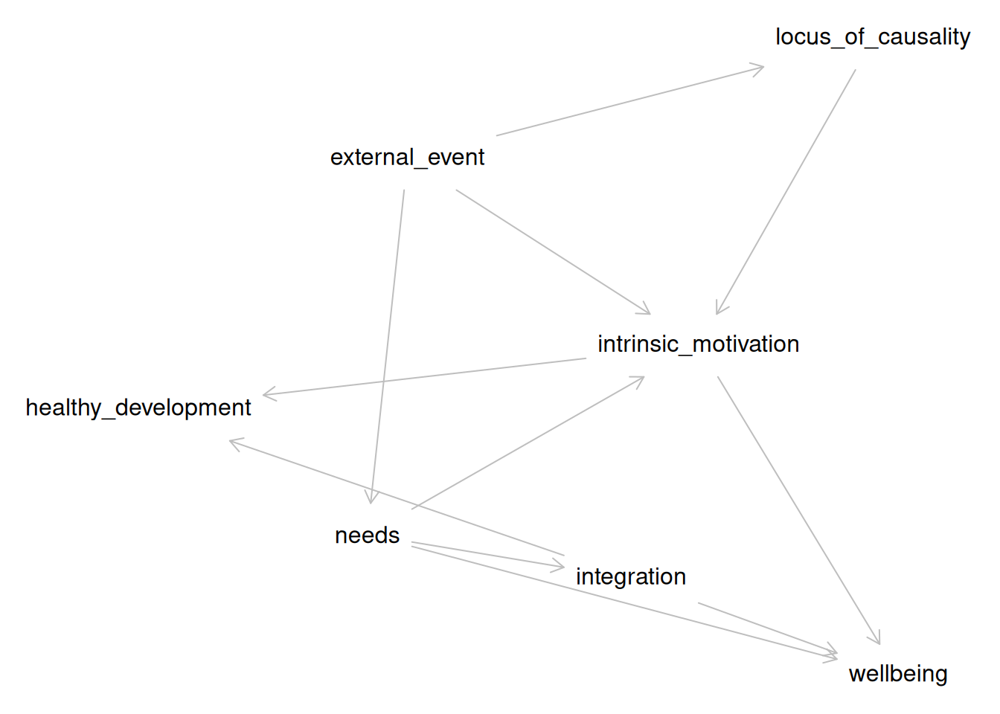
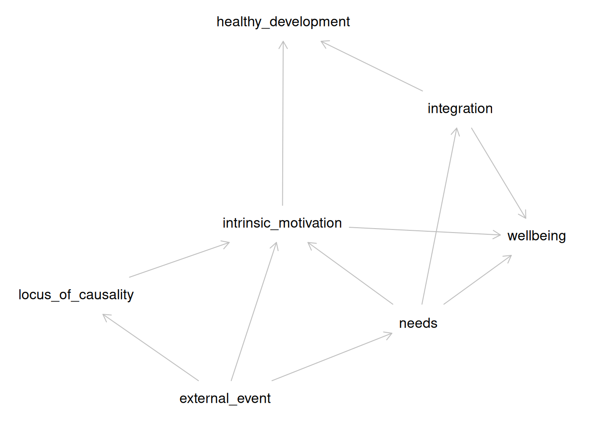

# Paul Meehl Graduate School Hackathon

## Preparing for the Workshop

To prepare, please do two things:

1.  Set up your personal computer before the course starts.
2.  Bring a theory from/relevant to your own research. That is to say: A
    paper, book chapter, or notes that describe the theory.

### Setup your computer

This vignette does not assume a prior installation of `R`, so it is
suitable for novice users. You only have to perform these steps once for
every computer you intend to use, and the entire process should take
approximately 30 minutes if you start from scratch. In case some of the
software is already installed on your system, you can skip those related
steps.

First, follow [this tutorial on how to set up your personal computer for
`worcs`](https://cjvanlissa.github.io/worcs/articles/setup.html).

Then, run this code:

``` r

install.packages("theorytools")
install.packages("dagitty")
library(theorytools)
library(dagitty)
```

    #> Welcome to WORCS: Workflow for Open Reproducible Code in Science. Run
    #> `check_worcs_installation()` to make sure all dependencies are installed. For
    #> more information, see the package vignettes
    #> (<https://cjvanlissa.github.io/worcs/articles>) and accompanying paper: Van
    #> Lissa and colleagues (2020) (<https://doi.org/10.3233/DS-210031>)

## Step 1: Select Sources

We will begin by selecting one “canonical version” of an existing
theory, or draft your own theory from scratch (optional).

***Credit:** This exercise is based on the Proposition Based Theory
Specification instructions \[@glocknerPBTSGuidelinesTemplates2025\].*

Read pages 1-4 of the [Proposition Based Theory Specification (PBTS)
Guideline](https://osf.io/qbs29/files/sz73h).

With your group, select source material for the theory (and specific
version of it) to be specified.

1.  Decide which theory, and which version of the theory (e.g.,
    original, revised, or latest) will be specified, including the name
    of the theory, the author, and the original reference. For example,
    I used Self-Determination Theory, a leading theory of motivation in
    social psychology.
2.  Select one canonical source for the theory specification (e.g., the
    original article or book chapter). If the theory is not fully
    specified in one source, or if you are drafting your own theory from
    scratch, select 2-3 key sources instead, such as relevant journal
    papers, or textbook chapters. For example, I used
    @ryanOxfordHandbookSelfDetermination2023.
3.  If the original theory is highly extensive (e.g., published as a
    book), simplify the task by focusing on its core content as
    represented in typical journal articles or summary chapters.
4.  Select specific lines within the source material that cover the
    theory’s key causal relations, concept definitions,
    operationalizations, and auxiliary assumptions. Create a spreadsheet
    [like
    this](https://cjvanlissa.github.io/theorytools/articles/Step_1.csv)
    with these selected sentences, label them (e.g., S1) and document
    the paper, page number, and ideally line number. The final version
    of Table 1 should include all agreed sources with page/line
    information, DOI, and, for books, the edition used. For example, see
    [this
    spreadsheet](https://cjvanlissa.github.io/theorytools/articles/Step_1.csv)
5.  All raters should agree on the selected sources. In cases of
    uncertainty, debate whether the sentence is indeed relevant to the
    theory.

> **Roll Your Own Theory**
>
> The exercise assumes that you will select an existing theory to
> improve upon. If you draft your own instead, go through all the steps
> *as if* you are starting from an existing theory - but instead of
> selecting sources from a published theoretical paper, you write your
> own.
>
> You may find it helpful to:
>
> - Select relevant quotes from *empirical papers* instead, to
>   substantiate the assumptions of your theory.
> - Compare your work to that of others/groups who have started with an
>   existing theory.

## Step 2: Code IF-THEN statements

Next, you will extract IF-THEN statements from the sources you selected
in Step 1.

Individually, fill out [Table
2](https://cjvanlissa.github.io/theorytools/articles/Step_2.csv).
Translate each source sentence into a set of implications (i.e., IF-
THEN statements) and all included propositions that together fully
describe the theory.

1.  Propositions are statements concerning measurable and non-measurable
    concepts that can be true or false, and represent an implication’s
    antecedence and consequence. E.g., “A person’s needs are satisfied”
    is a proposition.
2.  Propositions can be combined by any logical or mathematical
    operators, qualifiers, or, if necessary, user-defined uncommon
    operators (that have to be defined and operationalized).
3.  It is often possible to make certain conditions of a theory either
    part of the propositions or the definition/operationalizations. To
    keep the propositions simple, these conditions should be part of the
    definition/operationalizations if they do not belong to the core
    causal relations of the theory.
4.  In this step, remain as close as possible to the original verbal
    narrative while interpreting the text in accordance with the
    authors’ intended meaning.
5.  In the “Reference” column, reference the label of the text snippet
    from Step 1, e.g. S1, S2 … Sn.
6.  If the original specification mentions the functional form of a
    relationship, put this information in the Comment column.

### Combining Specifications-BINGO

As a group, read each other’s specifications. Select one participant’s
work to be the “starting point” for the definitive version. The author
of this version reads each of their implications aloud. Other
participants put a check mark in front of their implications if these
match the implication read by the first participant. If they are clearly
similar but there are important differences - discuss these and find
agreement on which version of the implication to keep in the definitive
version.

When the first participant is done reading all of their implications,
the other participants may have some remaining un-checked implications.
That is to say: Implications that they coded, but the first participant
did not. Discuss these to check whether they should be included in the
definitive version or not.

The end product should be a complete table of all unique implications
that all participants (more or less) agree upon.

> **Roll Your Own Theory**
>
> If you are making your own theory, do the exercise as described
> above - but instead of coding selected sentences, each participant
> lists all implications that *they think should be part of the theory*.
> The group activity then constitutes of discussing these and finding
> agreement about a set of implications.

## Step 3: Making a DAG

Next, you are going to translate your IF-THEN specifications into a
graph—the technical name is a **Directed Acyclic Graph (DAG)**. In this
graph, you connect concepts (propositions, in the language of PBTS) with
one-sided arrows to indicate the direction of causality.

Note that IF-THEN connections imply causal connections, so the statement
“IF a person’s need for autonomy is satisfied THEN they experience
well-being” implies a causal link of the form
`{autonomy satisfied} -> {well-being}`.

#### Example: Self-Determination Theory

Let’s examine a snippet from self-determination theory, and code it for
implied causality. The causes are coded in green, and outcomes in blue:

> “For these natural, active **processes of intrinsic motivation and
> integration** to operate effectively toward **healthy development and
> psychological well-being**, human beings need particular
> **nutriments** – both biological and psychological (Ryan, 1995). In
> the relative absence of such **nutriments**, these natural
> **processes** will be impaired, resulting in **experiences,
> development, and behaviors** that are less than optimal” (Lange et
> al., 2012, p. 417)

The text is a bit ambiguous, and possibly redundant. We see that
**processes**, in the first sentence, refers to intrinsic motivation and
integration. This invites the question of the relationship between
intrinsic motivation and integration - do they go hand in hand (i.e.,
just two examples of processes set in motion by nutriments)? Are they
distinct but similarly related to other constructs? It’s not clear.
Furthermore, in the second sentence, we find the word **processes**
again, but this time without explicit reference to intrinsic motivation
and integration. For now, we will assume that intrinsic motivation and
integration are distinct but have similar relationships to other
constructs, and that the word is used consistently across both
sentences.

**Nutriments** is defined elsewhere in the text - it appears to refer to
refer to the three basic needs, as well as biological necessities.

**Experiences, development, and behaviors** is not well-defined, but we
might assume it refers back to **healthy development and psychological
well-being**.

In Step 2, we learned to code snippets like this for IF-THEN connections
according to PBTS. This would give the following codings:

| N | IF | THEN | Original |
|---:|:---|:---|:---|
| 1 | nutriments are absent | intrinsic motivation AND integration are impaired | “For these natural, active processes of intrinsic motivation and integration to operate effectively toward healthy development and psychological well-being, human beings need particular nutriments – both biological and psychological (Ryan, 1995). In the relative absence of such nutriments, these natural processes will be impaired, resulting in experiences, development, and behaviors that are less than optimal. (Deci & Ryan, 2012, p. 417) |
| 2 | \[intrinsic motivation OR integration\] is present | healthy development AND psychological well-being take place | “For these natural, active processes of intrinsic motivation and integration to operate effectively toward healthy development and psychological well-being, human beings need particular nutriments – both biological and psychological (Ryan, 1995). In the relative absence of such nutriments, these natural processes will be impaired, resulting in experiences, development, and behaviors that are less than optimal. (Deci & Ryan, 2012, p. 417) |
| 3 | needs are satisfied or thwarted | psychological well-being of all people is affected | “The three basic psychological needs are universal such that their satisfaction versus thwarting affects the psychological well-being of all people.” (Deci & Ryan, 2012, p. 425) |
| 4 | rewards given | intrinsic motivation can decrease | “rewards do not always motivate subsequent persistence; indeed they can undermine intrinsic motivation” (Deci & Ryan, 2012, p. 417) |
| 5 | external event is expected to thwart the basic needs | external perceived locus of causality | “\[Intrinsic motivation\] could be either undermined or enhanced depending on whether the social environment supported or thwarted the needs for competence and self-determination. If a reward or other external event such as threat of punishment (Deci and Cascio, 1972), positive feedback (Deci, 1971), competition (Deci and Betley et al., 1981), or choice (Zuckerman et al., 1978) were expected to thwart these basic needs, it was predicted to prompt an external perceived locus of causality and undermine intrinsic motivation; but if the event were expected to support these basic needs, it was predicted to prompt an internal perceived locus of causality and enhance intrinsic motivation.” (Deci & Ryan, 2012, p. 418) |
| 6 | external perceived locus of causality | undermined intrinsic motivation | “\[Intrinsic motivation\] could be either undermined or enhanced depending on whether the social environment supported or thwarted the needs for competence and self-determination. If a reward or other external event such as threat of punishment (Deci and Cascio, 1972), positive feedback (Deci, 1971), competition (Deci and Betley et al., 1981), or choice (Zuckerman et al., 1978) were expected to thwart these basic needs, it was predicted to prompt an external perceived locus of causality and undermine intrinsic motivation; but if the event were expected to support these basic needs, it was predicted to prompt an internal perceived locus of causality and enhance intrinsic motivation.” (Deci & Ryan, 2012, p. 418) |
| 7 | external event is expected to support the basic needs | internal perceived locus of causality | “\[Intrinsic motivation\] could be either undermined or enhanced depending on whether the social environment supported or thwarted the needs for competence and self-determination. If a reward or other external event such as threat of punishment (Deci and Cascio, 1972), positive feedback (Deci, 1971), competition (Deci and Betley et al., 1981), or choice (Zuckerman et al., 1978) were expected to thwart these basic needs, it was predicted to prompt an external perceived locus of causality and undermine intrinsic motivation; but if the event were expected to support these basic needs, it was predicted to prompt an internal perceived locus of causality and enhance intrinsic motivation.” (Deci & Ryan, 2012, p. 418) |
| 8 | internal perceived locus of causality | enhanced intrinsic motivation | “\[Intrinsic motivation\] could be either undermined or enhanced depending on whether the social environment supported or thwarted the needs for competence and self-determination. If a reward or other external event such as threat of punishment (Deci and Cascio, 1972), positive feedback (Deci, 1971), competition (Deci and Betley et al., 1981), or choice (Zuckerman et al., 1978) were expected to thwart these basic needs, it was predicted to prompt an external perceived locus of causality and undermine intrinsic motivation; but if the event were expected to support these basic needs, it was predicted to prompt an internal perceived locus of causality and enhance intrinsic motivation.” (Deci & Ryan, 2012, p. 418) |

We can translate these IF-THEN statements into causal links between
specific constructs.

This translation reveals some ambiguities. For example, each IF-THEN
relationship is often repeated twice; once phrased in the positive and
once in the negative. Many propositions are repeated, once phrased in a
positive way, and once phrased in a negative way. For example, *human
beings \[need\] nutriments \[…\] for these processes to operate*
positively phrases a link from nutriments to processes, whereas *In the
\[absence of\] nutriments \[…\] processes will be impaired* negatively
phrases the same link. This can be confusing, especially if the two
phrasings differ slightly. Here, it seems safe to assume that both
sentences have the same meaning.

Another ambiguity is the lack of clear and consistent terminology. For
example, in proposition \#4, we see “rewards” are related to intrinsic
motivation. However, in the remainder of the text, rewards are mentioned
as just one example of “external events”. We assumed that “rewards” is
used as an example of the broader class of external events (pars pro
toto).

Another ambiguity: we read that “If \[an external event\] were expected
to thwart \[basic needs\], it \[prompts\] an external perceived locus of
causality”. Since the theory otherwise does not explain how people might
“expect” that external events will affect them, and this seems to be
more of a question for cognitive than social psychology - we made a
simplifying assumption: external events affect needs, and also perceived
locus of causality.

We applied two transformations:

1.  Replace the original text with concept labels, e.g. “nutriments are
    present” and “needs are satisfied or thwarted” are both replaced
    with “needs”.
2.  After this simplification, remove redundant links

| from                 | to                   |
|:---------------------|:---------------------|
| needs                | intrinsic_motivation |
| needs                | integration          |
| intrinsic_motivation | healthy_development  |
| intrinsic_motivation | wellbeing            |
| integration          | healthy_development  |
| integration          | wellbeing            |
| needs                | wellbeing            |
| external_event       | intrinsic_motivation |
| external_event       | needs                |
| external_event       | locus_of_causality   |
| locus_of_causality   | intrinsic_motivation |

Unique causal connections {.table .caption-top}

We translated this table to a DAG:

``` r

SDT <- dagitty(
  paste0("dag {",
  paste0(SDT$from, " -> ", SDT$to, collapse = "\n"),
  "}")
)
```

We can plot the DAG as follows:

``` r

plot(SDT)
#> Plot coordinates for graph not supplied! Generating coordinates, see ?coordinates for how to set your own.
```



Causal diagram implied by SDT

#### Do It Yourself

Following the example above, you will perform three tasks:

Grouping plain-language propositions into a limited set of concepts

Revising your `Step_2.csv` table so that it only uses that limited set
of concepts

Constructing a DAG in R using your revised table.

#### Group Propositions into Concepts

Make a copy of your `Step_2.csv` table, and call it `DAG.csv`.

With your groupmates, discuss:

- Which of the propositions (i.e., the text in the IF- and THEN-columns)
  are really the same? E.g.: Are “autonomy satisfaction” and “people
  feel more independent” really the same?
- Are any of them really the same, but positively vs negatively phrased
  (e.g., “autonomy satisfaction” and “frustration of the need for
  autonomy”)?
- How would you name them if you merged identical propositions? E.g.,
  you could use `autonomy_satisfaction`, or you could go even more
  abstract and use `need_satisfaction`, in which case you would use the
  same label for “autonomy satisfaction”, “competence satisfaction”, and
  “relatedness satisfaction”.

Obviously, these examples are based on SDT; use your own theory for this
exercise.

**Note: For technical reasons, it is preferable to use short labels
without any spaces or special characters. So use** `need_satisfaction`
**, not** `satisfaction (of different needs, like autonomy)`**.**

#### Revise your Table

Now go through your table, `DAG.csv`, and replace every original text
with the labels you decided on in the previous step.

#### Make DAG in R

Run the following code line by line:

``` r

library(theorytools)
library(dagitty)
my_theory <- read.csv("DAG.csv", stringsAsFactors = FALSE)[, c(2:3)]
names(my_theory) <- c("from", "to")
# Remove redundant statements
my_theory <- my_theory[!duplicated(my_theory), ]
my_theory <- dagitty(
  paste0("dag {",
  paste0(my_theory$from, " -> ", my_theory$to, collapse = "\n"),
  "}")
)
plot(my_theory)
```

## Step 4: Bring it to Life

The vignette [Formalizing Self-Determination
Theory](https://cjvanlissa.github.io/theorytools/articles/formalizing_sdt.html)
describes how the original Self-Determination Theory
\[@deciSelfDeterminationTheory2012\] was translated into a DAG. A DAG is
a diagram that specifies the causal relations proposed by a theory. Such
diagrams can be used to derive hypotheses, select control variables for
causal inference, and conduct simulation studies (as we will do now).

``` r

library(theorytools)
library(dagitty)
sdt <- dagitty("
dag {
external_event
healthy_development
integration
intrinsic_motivation
locus_of_causality
needs
wellbeing
external_event -> intrinsic_motivation
external_event -> locus_of_causality
external_event -> needs
integration -> healthy_development
integration -> wellbeing
intrinsic_motivation -> healthy_development
intrinsic_motivation -> wellbeing
locus_of_causality -> intrinsic_motivation
needs -> integration
needs -> intrinsic_motivation
needs -> wellbeing
}")
sdt
#> dag {
#> external_event
#> healthy_development
#> integration
#> intrinsic_motivation
#> locus_of_causality
#> needs
#> wellbeing
#> external_event -> intrinsic_motivation
#> external_event -> locus_of_causality
#> external_event -> needs
#> integration -> healthy_development
#> integration -> wellbeing
#> intrinsic_motivation -> healthy_development
#> intrinsic_motivation -> wellbeing
#> locus_of_causality -> intrinsic_motivation
#> needs -> integration
#> needs -> intrinsic_motivation
#> needs -> wellbeing
#> }
```

We can also plot this DAG:

``` r

plot(sdt)
```



Discuss with your group:

- Which portions of the DAG are relevant to the phenomenon you’ve
  identified?
  - Make a simplified version of the DAG that leaves out all irrelevant
    components.
- Is the simplified DAG sufficient to explain your identified
  phenomenon? If it helps, think of the arrows as IF/THEN links. If the
  causes are present, does the outcome always follow?
  - If not: What additions would you need to make to the DAG to properly
    describe the phenomenon?

#### Formalize the Initial Theory

We will construct a very basic formalization for the section of SDT that
you have selected.

First, we will simplify the DAG. You can do this by hand; suppose we are
interested in studying the effect of intrinsic motivation on well-being.
We do not need the entire theory to hypothesize about this specific
relationship. We can simplify the DAG to derive a restricted version of
the theory that includes all variables that might confound the
relationship of interest between intrinsic motivation and well-being:

``` r

sdt_pruned <- dagitty("
dag {
intrinsic_motivation -> wellbeing
external_event -> intrinsic_motivation
needs -> intrinsic_motivation
needs -> wellbeing
}")
sdt_pruned
#> dag {
#> external_event
#> intrinsic_motivation
#> needs
#> wellbeing
#> external_event -> intrinsic_motivation
#> intrinsic_motivation -> wellbeing
#> needs -> intrinsic_motivation
#> needs -> wellbeing
#> }
```

Do the same for the phenomenon you identified. When you have done so, we
can now create some code to generate a synthetic dataset based on this
simplified DAG, using the
[`simulate_data()`](https://cjvanlissa.github.io/theorytools/reference/simulate_data.md)
function. This function samples random values for exogenous variables
and computes endogenous variables as functions of their predictors
(linear functions, by default). By default, regression coefficients are
randomly sampled in the range `[-0.6, +0.6]` unless specific values are
provided by the user. You might improve the model by choosing more
realistic parameter values, for example, using the conventional values
for null (0), small (.2), or medium (.4) effect sizes. By default,
normal distributions are assumed for exogenous variables and residual
error, unless other distributions are specified.

Here, we first generate the code, then examine it in the console, then
write it to a file, and finally, run that file to create the simulated
data.

``` r

sim_code <- simulate_data(sdt_pruned, n = 100, run = FALSE)
sim_code
#>  [1] "# Set random seed"                                                          
#>  [2] "set.seed(1859152410)"                                                       
#>  [3] "# Set simulation parameters"                                                
#>  [4] "n <- 100"                                                                   
#>  [5] "# Simulate exogenous nodes"                                                 
#>  [6] "external_event <- rnorm(n = n)"                                             
#>  [7] "needs <- rnorm(n = n)"                                                      
#>  [8] "# Simulate endogenous nodes"                                                
#>  [9] "intrinsic_motivation <- 0.49 * external_event - 0.28 * needs + rnorm(n = n)"
#> [10] "wellbeing <- 0.14 * needs - 0.36 * intrinsic_motivation + rnorm(n = n)"     
#> [11] "df <- data.frame("                                                          
#> [12] "external_event = external_event,"                                           
#> [13] "intrinsic_motivation = intrinsic_motivation,"                               
#> [14] "needs = needs,"                                                             
#> [15] "wellbeing = wellbeing"                                                      
#> [16] ")"
writeLines(sim_code, "formal_model.R")
source("formal_model.R")
```

Put this code into a separate R-file. When you run it all, it will
create an object called `df`, which is a table with 100 observations for
all variables. Each exogenous variable (causes) is generated by drawing
random samples from a normal distribution. Each endogenous variable
(effects) is generated by multiplying those exogenous variables with a
regression coefficient; larger values mean that the exogenous variable
has a larger effect. Then, random noise is added, which represents
variability due to other causes not part of your model. If you want this
random variability to be smaller, change the `sd` argument of the
[`rnorm()`](https://rdrr.io/r/stats/Normal.html) function.

You can also make changes to your formal theory, to make it better
produce the kind of data patterns that your phenomenon implies.

You will probably not have time to do so, but it is possible to make
changes to the file `"formal_model.R"`.

For example, you can generate a binary variable using
[`rbinom()`](https://rdrr.io/r/stats/Binomial.html). For example, if you
want to conceptualize `external_event` as the presence or absence of a
reward, you could simulate a variable where approximately 50% of
observations have a value of 0 and 50% have a value of 1:

``` r

external_event <- rbinom(n = n, size = 1, prob = 0.5)
```

To make the effect of `external_event` on `intrinsic_motivation` depend
on `needs` (e.g., does this external event satisfy needs?), add an
interaction term to the equation that predicts `intrinsic_motivation`:

``` r

intrinsic_motivation <- 
  0.56 * external_event + 
  0.59 * needs +
  0.80 * external_event * needs +
  rnorm(n = n)
```

The 0.80 specifies the strength of the interaction.

In this example, the effect of external_event on intrinsic_motivation
becomes stronger as needs increases.

To create a nonlinear relationship, include a squared version of a
variable:

``` r

intrinsic_motivation <- 
  0.56 * external_event +
  0.59 * needs -
  0.70 * needs^2 +
  rnorm(n = n)
```

The negative coefficient on needs^2 creates an inverted n-shaped
relationship: intrinsic motivation initially increases with needs, but
at sufficiently high levels of needs it begins to decrease. A positive
quadratic coefficient instead produces a u-shaped relationship.

## Step 5: Making it FAIR

This last step helps you make your theory FAIR. Use one computer to
complete this tutorial together as a group. You will need to install
some software in the process, so it’s easier to just do that on one
system.

``` r

library(theorytools)
```

### Learning Goals

Create a project folder for your theory

Put this folder under version control with ‘Git’

Connect the local repository to a remote (‘GitHub’) repository

Add a shareable theory file to the repository

Add a LICENSE file to the repository (we recommend CC0)

Add a README file to the repository

Add a ‘Zenodo’ metadata to the repository

Push these changes to the remote repository

Turn on ‘Zenodo’ archiving for the remote repository

Publish a release of your theory

Verify that ‘Zenodo’ mints a DOI for your theory and its latest release


Conceptual workflow for this task.

As an example, we will continue to use the specification of
Self-Determination Theory (SDT).

``` r

theory <- '
dag {
external_event
healthy_development
integration
intrinsic_motivation
locus_of_causality
needs
wellbeing
external_event -> intrinsic_motivation [form="external_event:needs"]
external_event -> locus_of_causality
external_event -> needs
integration -> healthy_development
integration -> wellbeing
intrinsic_motivation -> healthy_development
intrinsic_motivation -> wellbeing
locus_of_causality -> intrinsic_motivation
needs -> integration
needs -> intrinsic_motivation  [form="external_event:needs"]
needs -> wellbeing
}'
```

### Creating a Project Folder

Create an empty project folder, which will become the theory archive. If
we want to create a new folder called `sdt` in the existing folder
`~/theories/`, we can call:

``` r

project_path <- file.path("~/theories", "sdt")
dir.create(project_path)
```

### Adding a Shareable Theory File to the Repository

Your theory should be represented as a digital artifact, such as a
structured plain-text document or a machine-readable file (e.g., ‘DOT’,
‘JSON’, ‘YAML’, ‘R’ code). You can simply write the text vector above to
a plain text file, like so:

``` r

writeLines(theory, file.path(project_path, "theory.txt"))
```

### Documenting Reusability with a LICENSE

A license ensures that others know how they can legally reuse your work.
We recommend a CC0 (Creative Commons Zero) license for FAIR theory,
which waives all copyright protection and places your work in the public
domain. This recommendation is based on the fact that copyright
protection does not cover ideas, and the assumption that FAIR theory is
created to maximize reuse. Other licenses are available, see
[https://choosealicense.com](https://choosealicense.com/non-software/).
You can add a license file to your repository like so:

``` r

worcs::add_license_file(path = project_path, license = "cc0")
```

### Documenting Interoperability with a README File

A README file describes the repository’s contents and purpose, making it
easier for others to understand your theory’s potential for
interoperability and reuse. The `theorytools` package contains a
function to generate a README file with appropriate sections for FAIR
theory, which can be used like so:

``` r

theorytools::add_readme_fair_theory(title = "Self-Determination Theory",
                                    path = project_path)
```

We encourage users to edit the resulting `README.md` file, in
particular, to add relevant information about X-interoperability. For
guidance on writing a README file for theory, see [this
vignette](https://cjvanlissa.github.io/theorytools/articles/readme.html).

### Adding ‘Zenodo’ Metadata to the Repository

In a later step, we will archive the theory on ‘Zenodo’. Creating a
`.zenodo.json` file with metadata about your theory allows the project
to be indexed automatically. This can be done by running:

``` r

add_zenodo_json_theory(
  path = project_path,
  title = "Self-Determination Theory",
  keywords = c("motivation")
)
```

### Version Controlling The Project Folder

We will use ‘Git’ to version control the project folder. This means that
changes to the files are explicitly tracked, and the entire history of
the theory-project is logged. One participant in your group should
install ‘Git’ on their computer, [as explained
here](https://git-scm.com/book/en/v2/Getting-Started-Installing-Git).
You can verify that ‘Git’ is installed and working by running:

``` r

worcs::check_git()
```

If this function shows a green checkmark, you can initialize version
control in your project repository by running:

``` r

gert::git_init(path = project_path)
```

### Connecting to a Remote (‘GitHub’) Repository

To make your FAIR theory accessible to collaborators and discoverable by
the wider community, you must connect your local ‘Git’ repository to a
remote repository on a platform like ‘GitHub’.

Before proceeding, ensure that one of your group members [has a ‘GitHub’
account](https://github.com/). To authorize ‘R’ to interact with your
‘GitHub’ account, run
[`usethis::create_github_token()`](https://usethis.r-lib.org/reference/github-token.html),
which takes you to a website to create a personal access token (PAT).
Copy it, then run
[`gitcreds::gitcreds_set()`](https://gitcreds.r-lib.org/reference/gitcreds_get.html)
and paste the PAT when asked. If you still experience problems try
[`usethis::gh_token_help()`](https://usethis.r-lib.org/reference/github-token.html)
for help.

To check that you are ready to proceed, run:

``` r

worcs::check_github()
```

If you see a green checkmark, you can create a new repository on
‘GitHub’ directly from ‘R’:

``` r

worcs::git_remote_create("fair_sdt", private = FALSE)
```

This command will create a new public repository on ‘GitHub’ and link it
to your local repository. The `private = FALSE` argument ensures the
repository is public by default.

Either way, assuming the name of that repository is `fair_sdt`, you can
connect it to your project folder as follows:

``` r

worcs::git_remote_connect(project_path, remote_repo = "fair_sdt")
```

### Pushing These Changes to the Remote Repository

Version control requires adding files to be tracked to the repository.
The `worcs` function
[`worcs::git_update()`](https://cjvanlissa.github.io/worcs/reference/git_update.html)
does this automatically, acting like a kind of “quick-save” or “save
all” function:

``` r

worcs::git_update("First commit of my theory", repo = project_path)
```

### Check Your ‘GitHub’ Repository

Navigate to your repository on ‘GitHub’ and check that all committed
files, including the theory file, license, README, and ‘Zenodo’
metadata, are now visible in the remote repository (green box in the
image below).


Front Page of a ‘GitHub’ Repository

Furthermore, the repository visibility must be set to “Public” to ensure
that ‘Zenodo’ can discover and archive it. If you created the repository
programmatically as shown above, it should already be public (see red
box in the image above).

### Login to ‘Zenodo’

Head over to [zenodo.org](https://zenodo.org). ‘Zenodo’ is a platform
where you can permanently archive your code and other project elements.
‘Zenodo’ does this by assigning projects a **Digital Object Identifier**
(DOI), which also helps to make the work more citable. This is different
to ‘GitHub’, which acts as a place where the actual work on a project
takes place, rather than long-term archiving of it. At ‘GitHub’, content
can be modified, deleted, rewritten, and irreversibly changed, which
makes it a bit concerning to be used for longer lasting referencing
purposes. ‘Zenodo’ offers more security and permanence for research
outputs.


Sign up for ‘Zenodo’

One participant should create a ‘Zenodo’ account. You can **login using
your ‘GitHub’ account** to make the registration process easy.

### Authorize ‘GitHub’ to connect with ‘Zenodo’

On the ‘Zenodo’ website authorize it to connect to your ‘GitHub’ account
in the ‘[Using ’GitHub’](https://zenodo.org/account/settings/github/)’
section. Here, ‘Zenodo’ will redirect you to ‘GitHub’ to ask for
permissions to use ‘[webhooks](https://developer.github.com/webhooks/)’
on your repositories. You want to authorize ‘Zenodo’ here with the
permissions it needs to form those links.


Authorize to connect with ‘GitHub’

### Select the Repository to Archive

> **Use the Zenodo Sandbox**
>
> You will now archive your project. This costs Zenodo some money and
> storage space. To be considerate, we will not **really** archive our
> project, but instead just practice archiving it in a “sandbox”
> environment.
>
> You can access the sandbox environment by navigating to
> <http://sandbox.zenodo.org/>.
>
> The links below already use the sandbox environment. If you ever need
> to properly archive something in the future, simply remove `sandbox.`
> from the link addresses.

If you have got this far, this means that ‘Zenodo’ is now authorized to
configure the repository webhooks that it needs to archive the
repository and issue it a DOI. To do this, on the ‘Zenodo’ website
navigate to the [‘GitHub’ repository listing
page](https://sandbox.zenodo.org/account/settings/github/) and simply
“flip the switch” next to your repository. If your repository **does not
show up** in the list, you may need to press the ‘Synchronize now’
button. At the time of writing, we noticed that it can take quite a
while (hours?) for ‘Zenodo’ to detect new ‘GitHub’ repositories. If so,
take a break or come back to this last step tomorrow!


Enable individual ‘GitHub’ repositories to be archived in ‘Zenodo’

### Create a New Release

To archive a repository on ‘Zenodo’, you must create a new release. You
can do this using the following code:

``` r

worcs::git_release_publish(repo = project_path)
```

If you have not previously published any releases, this function will
assume that you want to use semantic versioning for both the release tag
and the release title. This means that the first release will be labeled
with version number “0.1.0”. Each subsequent release will automatically
increment the trailing digit, i.e.: “0.1.1”, “0.1.2”. If you make a
major change to the theory, you may want to manually increment the
middle digit like so:

``` r

worcs::git_release_publish(repo = project_path,
                           tag_name = "0.2.0",
                           release_name = "0.2.0")
```

### Verify on ‘Zenodo’

To verify that your release was archived on ‘Zenodo’ and assigned a DOI,
you need to visit the [Uploads](https://sandbox.zenodo.org/deposit) tab.


Check the new release has been uploaded.

### Updating Meta-Data

We can further document our ‘Zenodo’ archive as a FAIR theory by adding
some extra information on ‘Zenodo’. Note that, if you created a
`.zenodo.json` file in a previous step, some of these metadata will be
populated automatically. On ‘Zenodo’ click the
[Upload](https://sandbox.zenodo.org/deposit) tab in the main menu, where
you should find your newly uploaded repository.


Click the orange Edit button.

Click the orange `Edit` button, and verify/supply the following
information:

Resource type: Should be set to `Model`

Title: Should be prefaced with `FAIR theory:`

Keywords and subjects: The first keyword should be `fairtheory`

Related works: Add the DOIs/identifiers of related (print) works. Use
the `Relation` field as appropriate. For example:

- `Is documented by` a theory paper you wrote, in which you introduce
  this FAIR theory
- `Is derived from` an existing theory, which was published in print
  (paper, book chapter) but not made FAIR

References: Optionally, cite related works in plain text. For example,
here we can provide the citation for the SDT theory book:

> Ryan, R. M. (Ed.). (2023). The Oxford Handbook of Self-Determination
> Theory (1st ed.). Oxford University Press.
> https://doi.org/10.1093/oxfordhb/9780197600047.001.0001

To save these changes, click ‘Publish’.

### Verifying That ‘Zenodo’ Mints a DOI for Your Theory

After publishing a release, ‘Zenodo’ will archive the repository and
mint a DOI. Verify this by checking the ‘Zenodo’ entry for your
repository, where the DOI will be displayed. Include this DOI in any
citations or references to your theory to enhance its discoverability
and reusability.

The ‘GitHub’/‘Zenodo’ integration will assign one “mother-DOI” to the
project, which will always resolve to the latest version, as well as a
unique DOI to each version/release of the FAIR theory. This enables
users to refer to and cite either the theory in general or specific
versions of the theory. The list of authors for the citation is
automatically determined by the ‘GitHub’ user account names used by the
repository - this can be edited on ‘Zenodo’, as explained above. DOIs
used in ‘Zenodo’ are registered through the
[DataCite](https://www.datacite.org/) service.

> **Pro-tip**: Check the `Citation` field on the ‘Zenodo’ page, and
> copy-paste it into the README file of your ‘GitHub’ repo to make
> cross-linking even easier (or refer users to the ‘Zenodo’ page to find
> the citation, which obviates the need to manually update this
> information). Click the DOI badge in the `Details` field to get
> instructions on how to add a clear highlighted DOI badge to your
> ‘GitHub’ repository, for users to see and make use of your DOI:

### CONGRATULATIONS!

Your FAIR theory is now archived in ‘Zenodo’, and with a DOI that can be
versioned to reflect updates to the repository version through time. You
should be able to see details of this on the ‘GitHub’ ‘Zenodo’ page for
your repository. This also means that your archived projects can get
picked up by other indexing services and search engines that use DOIs
too.

Providing a long-term archive and a DOI for your work is required for
others to be able to properly cite it, as this provides basic citation
metadata. For Open Science, it is important to be able to
comprehensively cite the resources that you use in your research,
including theory, and this workflow enables that to happen, in line with
best practices. Making theory FAIR also helps elevate the standard of
theory to that of the standard of other research outputs, like papers
and software.

### Checklist for citing your project

So now you have a sustainably archived ‘GitHub’ repository in ‘Zenodo’
that is ready to be re-used and cited! Before continuing, make sure that
you have:

Linked your ‘GitHub’ project to ‘Zenodo’. If you see a complete copy of
your ‘GitHub’ repository in ‘Zenodo’ then things are working.

‘Zenodo’ and ‘GitHub’ integrated setup works nicely. For example have
all the author names, and correct project title come across to ‘Zenodo’.
If not, or if authors just have nicknames you can edit these details in
‘Zenodo’.

Project has a first release, with a DOI. You should have a DOI displayed
on your projects ‘Zenodo’ page. This first DOI is called the ‘concept
DOI’ and is the master DOI linking to all subsequent release DOIs. Copy
this DOI link and embed it in your ‘GitHub’ projects README page. You’re
done!
