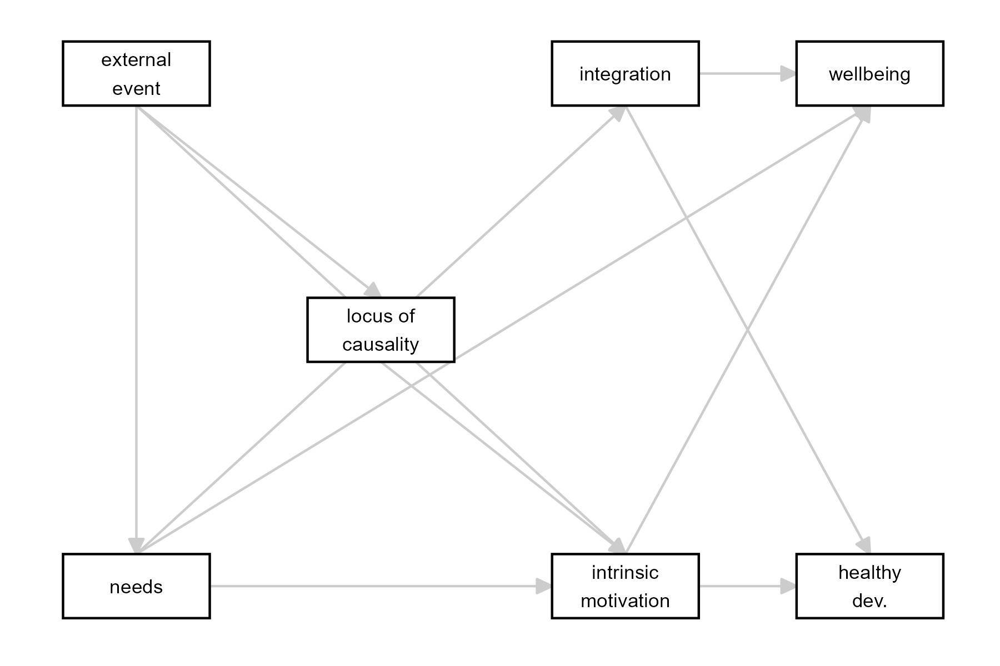

```{r, include = FALSE}
knitr::opts_chunk$set(
  collapse = TRUE,
  comment = "#>"
)
```

```{r setup}
library(theorytools)
```


```{r eval=FALSE, results='asis', echo=FALSE}
# This quizz is only shown in HTML output format
theorytools:::quizz(
"The answer to this question is true." = TRUE,
"This multiple choice question has three answers." =
c("Correct", "Incorrect", "Not sure"),
"Provide an exact floating point answer of 0.81" = 0.81,
"Or give some wiggle room" = c(0.81, .1),
"How many words in this sentence" = 6L
)
```

We start with the specification by Van Lissa and colleagues, conducted as part of Fiedler & Glöckner's many-theorists project.
The definition of SDT is taken from this book chapter, but it seems to be consistent with the description on <https://selfdeterminationtheory.org/the-theory/>:

> Lange, P. A. M. V., W.Kruglanski, A., ToryHiggins, E., Deci, E. L., & Ryan, R. M. (2012). Self-Determination Theory. In Handbook of Theories of Social Psychology: Volume 1 (pp. 416–437). SAGE Publications Ltd. https://doi.org/10.4135/9781446249215


```{r}
SDT1 <- read.csv("../dev/sdt1.txt")
names(SDT1) <- c("N", "IF", "THEN", "Original")
knitr::kable(SDT1[, 1:4], caption = "SDT translated into IF/THEN statements")
```


Next, we specify these verbal IF/THEN statements into causal links between specific constructs.
Note that the numbers associated with the statements are retained,
so that it is clear which causal links are derived from which IF/THEN statements:

```{r}
SDT2 <- read.csv("../dev/sdt2.txt")
names(SDT2) <- c("N", "from", "to", "form")
knitr::kable(SDT2[, 1:3], caption = "IF/THEN statements translated into causal connections")
```

This specification reveals redundancies in the original theory.
Certain points were repeated, once phrased in a positive way, and once phrased in a negative way.
When the statements are reduced to their implied causal connections, the redundancies become apparent.
Now, we can simply remove the redundancies as follows:

```{r}
# Drop statement numbers
SDT2 <- SDT2[, 2:3]
# Remove redundant statements
SDT2 <- SDT2[!duplicated(SDT2), ]
knitr::kable(SDT2, caption = "Unique causal connections")
```

We can translate this table to a DAG:

```{r}
SDT <- dagitty::dagitty(
  paste0("dag {",
         paste0(SDT2$from, " -> ", SDT2$to, collapse = "\n"),
         "}"))
```

We can plot the DAG as follows:

```{r echo = FALSE, out.width="70%", fig.cap="Causal diagram implied by SDT"}
library(tidySEM)
library(ggplot2)
lo <- get_layout(
"EE", "",   "IN", "WB",
"",   "LC", "",   "",
"NE", "",   "IM", "HD",
  rows = 3
)
renam <- c(EE = "external_event", NE = "needs", IN = "integration", WB = "wellbeing", 
           LC = "locus_of_causality", HD = "healthy_development", IM = "intrinsic_motivation")

lo[match(names(renam), lo)] <- renam
p <- prepare_graph(SDT, layout = lo, angle = 179, text_size = 3, rect_width = 1.5, spacing_x = 2.5)

renam <- c(external_event = "external\nevent", needs = "needs", integration = "integration", wellbeing = "wellbeing", 
           locus_of_causality = "locus of\ncausality", healthy_development = "healthy\ndev.", intrinsic_motivation = "intrinsic\nmotivation")

p$nodes$shape <- "rect"
p$nodes$label <- renam[p$nodes$name]
g <- plot(p)
ggsave("sdt.png", g, device = "png", width = 6, height = 4)

```


Now, let's look at the operationalizations of the constructs in the DAG.

```{r}
SDT_operationalizations <- read.csv("../dev/sdt_op.txt", sep = "\t")
SDT_operationalizations$Operationalization <- gsub("MIS", "Missing:", SDT_operationalizations$Operationalization, fixed = TRUE)
SDT_operationalizations$Operationalization <- gsub("DER", "Derived from other source:", SDT_operationalizations$Operationalization, fixed = TRUE)
knitr::kable(SDT_operationalizations, caption = "Operationalizations of constructs in SDT")
```


